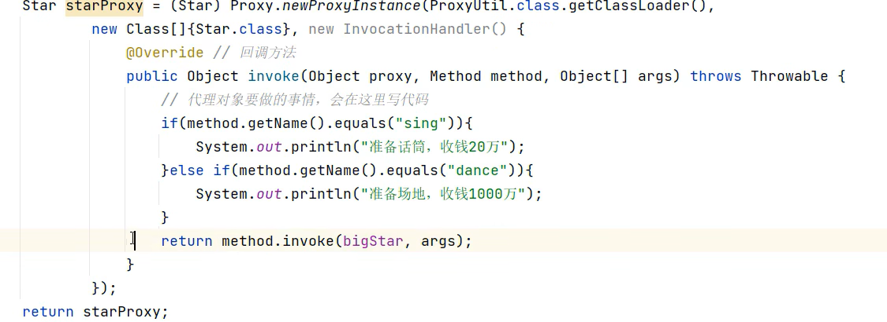
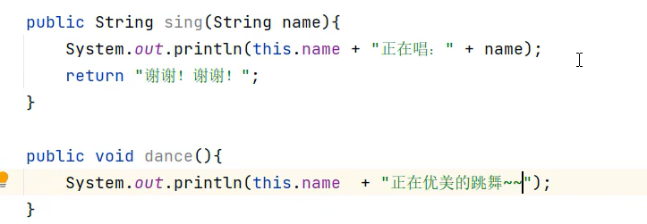

1. 集合的分类有哪些？

   Java集合框架主要分为四类：List（有序、可重复）、Set（无序、不可重复）、Queue（队列，先进先出）、Map（键值对存储）。每种类别都有不同的实现类，如ArrayList和LinkedList实现了List接口，HashSet实现了Set接口，HashMap实现了Map接口等。
    **记忆点：List、Set、Queue、Map**

   

2. **迭代器的实现原理是什么？**

   迭代器提供了一种访问集合元素的方式，而不需要暴露其底层表示。它通过`hasNext()`判断是否有下一个元素，通过`next()`方法返回下一个元素，并支持`remove()`操作。对多种集合，遍历掌握此即可
   充分利用前面已经释放的空间

   ```java
   ...
   import java.util.Iterator;
   public class IteratorExample {
       public static void main(String[] args) {
           List<String> list = new ArrayList<>();
           list.add("Apple");...
           // 获取list的迭代器
           Iterator<String> iterator = list.iterator();
           // 使用while循环遍历列表
           while (iterator.hasNext()) {  // 判断是否还有下一个元素
               String element = iterator.next();  // 获取下一个元素
               System.out.println(element);
           }}}
   ```

3. 为什么 new ArrayList<>（）时建议指定初始化容量值

   指定初始容量可以减少扩容次数，避免频繁分配新数组带来的性能开销。如果预先知道数据量大小，设定合适的初始容量能提高效率，尤其是在处理大量数据时尤为重要。
    **记忆点：减少扩容、提高效率、预知数据量。**

   

4. **为什么 ArrayList 默认情况下的扩容机制是扩容为原数组的1.5倍**

   k=1.5时，就能充分利用前面已经释放的空间。如果k >= 2，新容量刚刚好永远大于过去所有废弃的数组容量。

   1. 扩容容量不能太小，防止频繁扩容，频繁申请内存空间 + 数组频繁复制
   2. 扩容容量不能太大，需要充分利用空间，避免浪费过多空间；

    **记忆点：充分利用已释放空间**

   

5. ArrayList是线程的安全吗

   ArrayList不是线程安全的，若在多线程环境中使用需要额外的同步措施或者使用Collections.synchronizedList包装，也可以选择线程安全的替代品如CopyOnWriteArrayList。
    **记忆点：非线程安全、需要同步、CopyOnWriteArrayList。**

   

6. **CopyOnWriteArrayList 的实现原理**

   COW(CopyOnWriteArrayList)复制数据引用，所以在读取时获取迭代器时很快，在增删时复制原数组到新数组并进行增删，效率低但是线程安全，适用于读多写少环境。

    **记忆点：复制引用、读取很快、增删新数组，读多写少。**

   

7. HashMap的添加元素流程

   HashMap通过计算键的哈希值确定元素存放位置。如果发生碰撞（即两个键的哈希值相同或不同的键映射到了数组的同一位置），则使用链表或红黑树处理。插入时首先检查是否需要扩容，然后根据哈希值找到对应桶位进行插入。

    **记忆点：哈希值、链表/红黑树、检查扩容。**

   

8. **HashMap扩容加载因子为什么是0.75**

   0.75作为默认加载因子是在空间利用率和查找效率之间的一个平衡选择。较高的加载因子可以提高空间利用率但增加哈希冲突的概率；较低的加载因子则相反。0.75被认为是一个合理的折衷点，既能保证较高的空间利用率又能保持较低的冲突率。eg：长16，存12扩长

    **记忆点：空间与查找效率、合理折衷。**

   

9. **HashMap扩容为什么扩容为数组长度的2倍**

   （n - 1）& hash 的意思是将每个元素key的hash值，与最大索引值进行相与操作。当数组初始长度为16的时候，每次扩容都为之前的2倍，那么就保证了每次扩容之后新数组的最大索引值对应的二进制数为全1。那么就能保证添加到HashMap中key的hash值与最大索引相与时，能够最大化的分散到HashMap所有的 bucket 中，进而最大化避免出现 hash碰撞而形成链表或者红黑树。

    **记忆点：（n - 1）& hash、保证二进制全1、最大化分散。**

   

10. HashMap是线程的安全吗

    HashMap不是线程安全的。在多线程环境下使用HashMap可能会导致数据不一致的问题。对于线程安全的需求，可以考虑使用ConcurrentHashMap或者Collections.synchronizedMap封装。

     **记忆点：非线程安全、ConcurrentHashMap、synchronizedMap。**

    

11. ConcurrentHashMap的实现原理

    ConcurrentHashMap采用了分段锁技术，将数据分成多个段（1.7适用，1.8后每个节点加锁），每个段都可以独立锁定，从而允许多个线程同时访问不同的段，提高了并发性能。此外，它还优化了读操作的锁机制，使得大多数情况下读取不需要加锁。

     **记忆点：分段锁、高并发性能、优化读操作。**

    

12. **泛型是什么？泛型的好处？类型擦除是什么？**

    泛型本质是参数化类型，解决不确定对象具体类型的问题。
    泛型的好处：① 类型安全，放置什么出来就是什么，不存在 ClassCastException。
    ② 提升可读性，编码阶段就显式知道泛型集合、泛型方法等处理的对象类型。 
    ③ 代码重用，合并了同类型的处理代码，不用不同类型不同代码。
    泛型擦除是什么：泛型用于编译阶段，编译后的字节码文件不包含泛型类型信息，因为虚拟机没有泛型类型对象，所有对象都属于普通类。例如定义 List<0biect>或 List<Integer>，在编译后都会变成 List。所以括号内不能放基本类型，因为object不能被基本类型赋值。

     **记忆点：参数化类型、合并同类型方法、字节码文件不包含泛型类型信息吗，回归object。**

    

13. **反射是什么？反射的好处？反射的使用场景？**

       A类被加载器加载后存入方法区和堆空间，方法区存储类信息(构造函数、方法)；堆中存储类的class对象，后续新建对象时，会指向堆中对象，堆中对象从方法区对象中获取对应数据结构；

       反射机制就是在运行时通过堆中Class对象动态获取类信息及操作类成员

       好处是 灵活性和扩展性：1.反射使得代码更加灵活，因为它允许在运行时决定要创建的对象类型或要调用的方法。2.处理未知类型的对象：在不知道具体类型的情况下，反射允许你处理对象。

    使用场景：第二个项目中对不同的实例对象进行不同操作

     **记忆点：JVM类加载(堆+方法区)、获取堆对象、灵活、处理未知对象**

    

14. **动态代理有哪些方式？原理是什么？**

    JDK动态代理通过`InvocationHandler`和`Proxy`类利用反射机制在运行时为接口生成代理对象，处理方法调用。CGLIB则采用字节码生成技术，通过继承目标类创建子类实现代理，重写方法添加额外逻辑，不支持final类或方法。

    **关键词：反射机制、接口生成代理对象、字节码生成、InvocationHandler、Proxy、继承机制。**

    

    

    

15. **JDK新特性：虚拟线程的原理了解吗？**

    虚拟线程在JDK 19中作为预览特性引入，允许创建大量轻量级线程，由JVM而非操作系统管理与调度，当阻塞时自动释放栈空间，支持高效的任务处理，减少资源消耗并提高并发性能。

    **关键词：JDK 19, 虚拟线程, 轻量级, JVM调度, 栈空间释放, 高效并发。**

