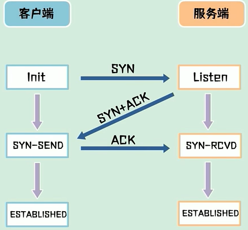
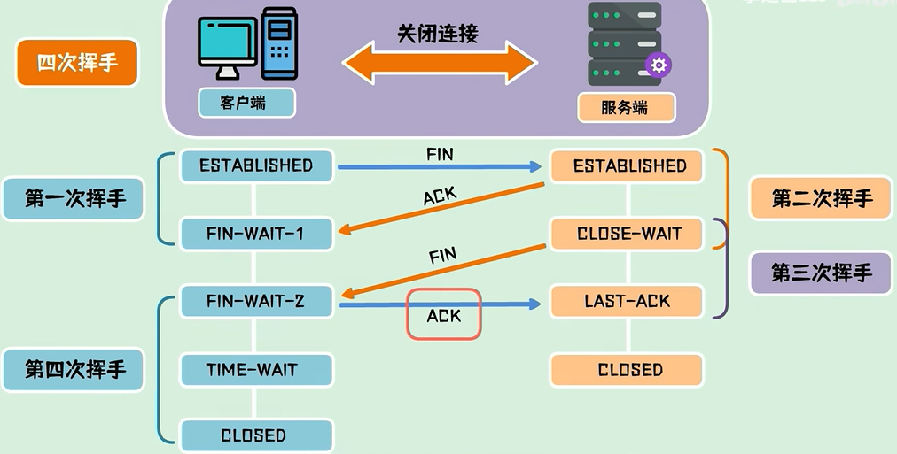

## TCP

- 传输协议（传输层）

### 三次握手两次挥手

- 本质是解决网络信道不可靠的问题，为能在不可靠的信道上建立可靠的连接

#### 三次握手

三次握手是用来在客户端与服务器之间建立一个可靠的TCP连接的过程。这个过程通过交换三个报文段来完成：

1. **第一次握手**：客户端向服务器发送一个SYN报文段，**表示希望与服务器建立连接**，并进入SYN_SEND状态。
2. **第二次握手**：服务器接收到客户端的SYN报文后，需要确认客户端的SYN，**如果同意连接，即回复一包SYN+ACK报文**。此时，服务器进入SYN_RECV状态。
3. **第三次握手**：客户端收到服务器的SYN+ACK报文后，**再次对服务器的SYN进行确认，表示能正常接收到数据，发送ACK报文给服务器**。之后，双方都进入ESTABLISHED状态，表示连接已经成功建立，可以开始数据传输。

#### 四次挥手

四次挥手则是用来**安全地关闭一个已建立的TCP连接**。由于TCP连接是全双工的，这意味着每个方向上的数据流都需要独立关闭，因此需要四个步骤：

1. **第一次挥手**：主动关闭方发送一个FIN（结束标志，Finish），**表示本端不再有数据要发送了，但还可以接收对方的数据**，进入FIN_WAIT_1状态。
2. **第二次挥手**：被动关闭方（通常是服务器）接收到FIN后，**向主动关闭方发送ACK确认信息，表明收到了对方的关闭请求**，但此时被动关闭方可能还有未发送完的数据或未处理完的数据需要继续处理，因此不会立即关闭连接。此时，被动关闭方进入CLOSE_WAIT状态，而主动关闭方则进入FIN_WAIT_2状态。
3. **第三次挥手**：**当被动关闭方完成了所有的数据发送后，它会发送一个FIN给主动关闭方，表明自己也没有更多数据要发送了，并准备关闭连接**。这时，被动关闭方进入LAST_ACK状态。
4. **第四次挥手**：主动关闭方**收到被动关闭方的FIN后，必须给出确认ACK响应**，随后进入TIME_WAIT状态。在这个状态下，主动关闭方等待足够长的时间以确保被动关闭方收到了ACK报文并完全关闭连接。一段时间后，如果没有收到额外的数据包，则主动关闭方也会关闭连接，释放资源。