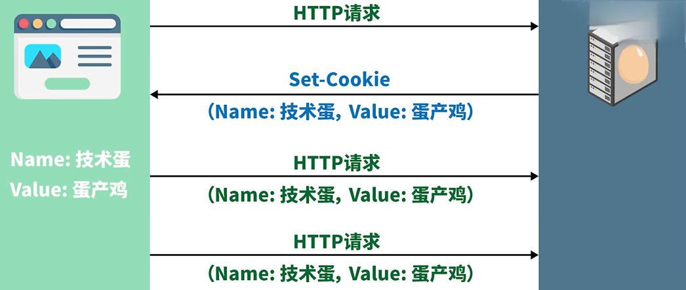
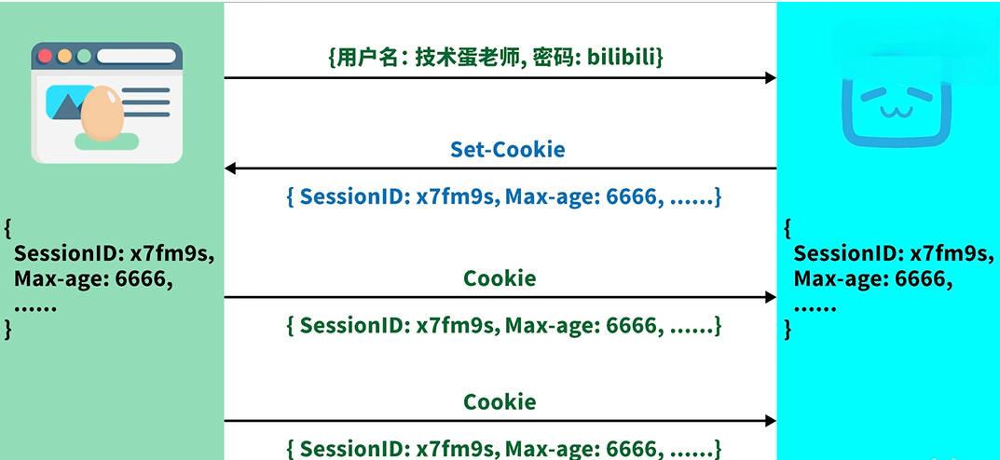
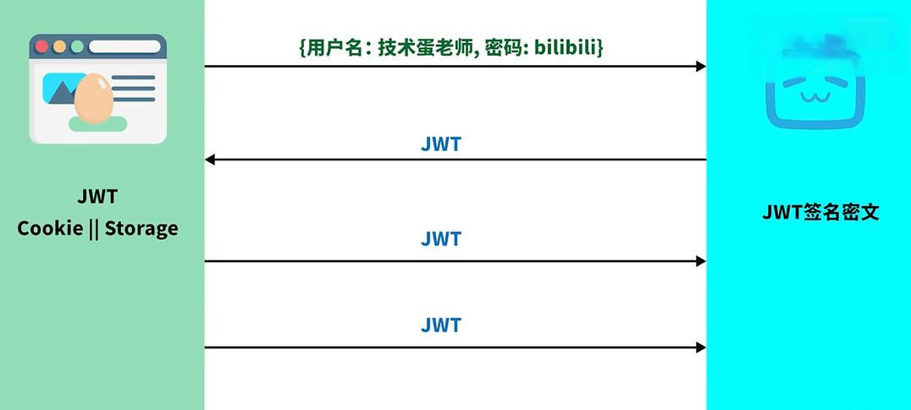

### HTTP传输与安全

- 核心的概念是存储（应用层协议）

#### Cookie

- **流程**

  浏览器发起HTTP请求，服务器进行Cookie设置 - 包含名`name`和值`value`，服务器把内容填充完后发回给浏览器，浏览器保存Cookie，这样以后发送的每个请求都会自动附上Cookie

- **特点**

  不安全，请求信息直接暴露在用户浏览器中

  

#### Session

- **流程**

  浏览器发送用户密码账号给服务器，服务器检验/创建后返回`SessionID`和`MaxAge`通过Cookie给浏览器进行保存，其中`SessionID`是没有规律的字符串，服务器通过ID可以检验对应存储的用户信息，`MaxAge`是`SessionID`的有效时间

- **特点**

  基于Cookie的会话技术，通过校验标志符确认用户，确保安全，但数据存储在服务端可能出问题

  

#### Token

- **流程**

  浏览器把用户创建信息发给服务端，服务依据用户信息生成`JWT`，把`JWT`通过Cookie发送回浏览器，浏览器以Cookie形式保存`JWT`，服务端保存`JWT`的解密算法，这样浏览器可以通过密文访问服务端，服务端解密即可找到对应用户信息。

- **特点**

  浏览器存储包含用户信息的密文，服务端保存解密算法，确保数据不丢失与保证安全性

  

