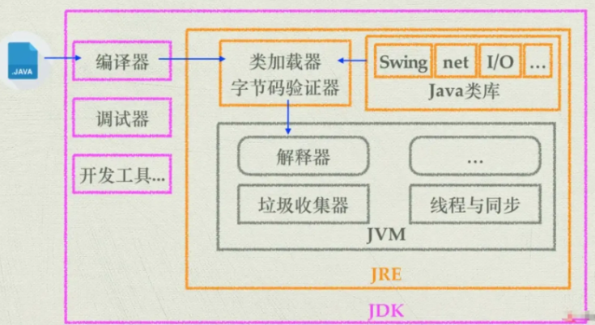
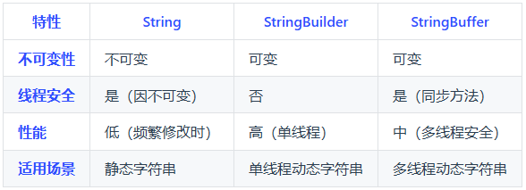

### 概念


#### Java的特点

- **平台无关性：**“编写一次，运行无处不在“，Java编译器将源代码编译成字节码(bytecode)，该字节码可以在任何安装了Java虚拟机(JVM)的系统上运行。
- **面向对象：**Java是一门严格的面向对象编程语言，几乎一切都是对象。面向对象编程（OOP）特性使得代码更易于维护和重用，包括类(class)、对象(object)、继承(inheritance)、多态(polymorphism)、抽象(abstraction)和封装 (encapsulation)。
- **内存管理：**Java有自己的垃圾回收机制，自动管理内存和回收不再使用的对象。开发者不需要手动管理内存，从而减少内存泄漏和其他内存相关的问题。


#### JVM、JDK、JRE关系

- **JVM是Java虚拟机**，是Java程序运行的环境。它负责将Java字节码编译成机器码，并执行程序。JVM提供了内存管理、垃圾回收、安全性等功能，使得Java程序具备跨平台性。
- **JDK是Java开发工具包**，是开发Java程序所需的工具集合。它包含了JVM、编译器(javac)、调试器(jdb)等开发工具，以及一系列的类库。
  JDK提供了开发、编译、调试和运行Java程序所需的全部工具和环境。
- **JRE是Java运行时环境**，是Java程序运行所需的最小环境。它包含了JVM和一组Java类库，用于支持Java程序的执行。JRE不包含开发工具，只提供Java程序运行所需的运行环境。



#### 数据类型

- **基本类型：**Java八种基本数据类型的字节数：1字节(byte、boolean)、2字节(short、char)、4字节(int、float)、8字节(long、double)


### 面向对象


面向对象是一种**编程范式**，它将现实世界中的事物抽象为对象，对象具有属性和行为方法。面向对象编程的设计**思想是以对象为中心**，通过**对象之间的交互来完成程序的功能**，具有灵活性和可扩展性，通过封装和继承可以更好地应对需求变化。

Java面向对象的三大特性包括：**封装、继承、多态**

- **封装**：封装是指将对象的属性（数据）和行为（方法）结合在一起，**对外隐藏对象的内部细节**，**仅通过对象提供的接口与外界交互**。封装的目的是增强安全性和简化编程，使得对象更加独立。

- **继承**：继承是一种可以使得**子类共享父类数据结构和方法的机制**。它是代码复用的重要手段，通过继承可以建立类与类之间的层次关系，使得结构更加清晰。

- **多态**：多态是指允许不同类的对象对同一消息作出响应。即**同一个接口，使用不同的实例而执行不同操作**。**多态性可以分为编译时多态（重载）和运行时多态（重写）**。它使得程序具有良好的灵活性和扩展性。

  - **多态是什么**

    同一操作作用于不同对象时，会产生不同的行为。其核心是 “**一个接口，多种实现**”，子类替代父类，提高代码的扩展性和复用性。

  - **重写 ( Override ) ：子类重定义父类的相同方法**

    ```java
    class Animal {
        protected void eat() {
            System.out.println("动物吃东西");
        }
    }
    class Cat extends Animal {
        @Override // 明确标记重写
        public void eat() { // 访问权限不能比父类更严格
            System.out.println("猫吃鱼");
        }
    }
    public class Main {
        public static void main(String[] args) {
            Animal animal = new Cat(); // 多态
            animal.eat(); // 输出："猫吃鱼"（实际调用子类方法）
        }
    }
    ```

  - **重载 ( Overload )：同一类中定义同名但参数不同的方法** 

    ```java
    class Calculator {
        // 重载：相同，参数不同
        public int add(int a, int b) {
            return a + b;
        }
        public double add(double a, double b) { // 参数类型不同
            return a + b;
        }
        public int add(int a, int b, int c) { // 参数数量不同
            return a + b + c;
        }
    }
    public class Main {
        public static void main(String[] args) {
            Calculator calc = new Calculator();
            System.out.println(calc.add(1, 2));       // 调用int版本
            System.out.println(calc.add(1.5, 2.5));   // 调用double版本
        }
    }
    ```


#### **静态变量与方法**

​	在Java中，静态变量和静态方法是**与类本身关联**的，而不是与类的实例（对象）关联。它们在**内存中只存在一份，可以被类的所有实例共享**。静态变量
是在类中使用static关键字声明的变量。它们属于类而不是任何具体的对象。


### Object

#### == 与 equals 有什么区别?

使用“ == ”和“equals“比较字符串时，其**比较方法不同**。**" == ”比较两个变量本身的值**，即两个对象在内存中的**首地址**，"equals“**比较包含内容是否相同**。对于非字符串变量来说，如果没有对 equals 进行重写的话，"=="和"equals”方法的作用是相同的，都是用来比较对象在堆内存中的首地址，即用来比较两个引用变量是否指向同一个对象。

- "=="：比较的是两个变量的内存地址（堆内存）的数值是否相等，属于数值比较；

- equals：比较的是两个变量的内容，属于内容比较。（除String，其他类型相同，都是比较地址）

  

#### **final**

final关键字主要有以下三个方面的作用：用于修饰类、方法和变量。

- **修饰类：**当final修饰一个类时，表示这个**类不能被继承**，是类继承体系中的最终形态。例如，Java中的string类就是用final修饰的，这保证了String类的不可变性和安全性，防止其他类通过继承来改变String类的行为和特性。

- **修饰方法：**用final修饰的方法**不能在子类中被重写**。比如，java.lang.Object 类中的 getClass 方法就是final的，因为这个方法的行为是由Java虚拟机底层实现来保证的，不应该被子类修改。

- **修饰变量：**当final修饰基本数据类型的变量时，该**变量一旦被赋值就不能再改变**。例如，final int num＝10；这里的num是常量，不能再对其进行重新赋值操作，否则会导致编译错误。对于引用数据类型，final修饰意味着这个引用变量不能再指向其他对象，但对象本身的内容是可以改变的。
  例如,final StringBuilder sb = new StringBuilder("Hello");，不能让 sb再指向其他StringBuilder对象，但可以通过sb.append("World");来修改字符串的内容。

  

#### String、StringBuffer、StringBuilder的区别和联系

- **可变性：**String是**不可变**的，一旦创建，内容无法修改，**每次修改都会生成一个新的对象**。StringBuilder和StringBuffer是**可变的**，可以直接对字符串内容进行修改而**不会创建新对象**。

- **线程安全性：**String因为不可变，天然**线程安全**。StringBuilder不是线程安全的，适用于单线程环境。StringBuffer是线程安全的，其方法**通过synchronized关键字实现同步**，适用于多线程环境。

- **性能：**String性能最低，在修改字符串时会生成大量临时对象，**增加内存开销和垃圾回收压力**。StringBuilder性能最高，因为它没有线程安全的开销，适合单线程下的字符串操作。StringBuffer性能略低于StringBuilder，因为它的线程安全机制引入了同步开销。

- **使用场景：**如果字符串**内容固定或不常变化**，优先使用**string**。如果需要**频繁修改字符**串且在**单线程**环境下，**使用StringBuilder**。如果需要**频繁修改字符串且在多线程环境下**，使用**StringBuffer**。

  


#### 浅拷贝与深拷贝

- 浅拷贝是只复制对象本身和其内部的**值类型字段**，但**不会复制对象内部的引用类型字段**。 
  浅拷贝只是创建一个新的对象，然后将原对象的字段值复制到新对象中，但如果原对象内部有引用类型 的字段，只是将引用复制到新对象中，**两个对象指向的是同一个引用对象。** 

  ```java
  person类包含address类对象
  创建person1对象并克隆出person2；二者的addre类对象是同一个
  ```

- 深拷贝是指在复制对象的同时，将对象内部的所有引用类型字段的内容也复制一份，而不是共享引用。 换句话说，**深拷贝复制对象内部所有引用类型的字段，生成一个全新的对象以及其内部的所有对象。**

  ```java
      // 浅拷贝
      @Override
      protected Object clone() throws CloneNotSupportedException {
          return super.clone();
      }
      // 深拷贝
      public Person deepClone() {
          Address clonedAddress = new Address(this.address.city);
          return new Person(this.name, clonedAddress);
      }
  ```

  - 深拷贝3种实现方法

    - 实现 Cloneable 接口并重写 clone() 方法

    - 使用序列化和反序列化

    - 手动递归复制

      

#### 泛型

泛型是Java编程语言中的一个重要**特性，**它**允许类、接口和方法在定义时使用一个或多个类型参数**，这些类型参数在使用时**可以被指定为具体的类型**，可以**对方法进行复用**，泛型的主要目的是在编译时提供更强的类型检查，并且在编译后能够保留类型信息，避免了在运行时出现类型转换异常。

例子：要实现不同类型的加法，如果没有泛型，每种类型都需要重载一个add方法；通过泛型，我们可以复用为一个方法


#### Native

native是一种特殊类型的方法，它允许Java代码调用外部的本地代码，即用C、C++或其他语言编写的代码。native关键字是Java语言中的**一种声明**，用于标记一个方法的实现将在外部定义


### RESTFUL API

在构建Web服务和应用程序时有优势，以下是选择使用REST的一些主要原因：

1. **简单性**
  REST利用了**现有的HTTP协议**，**不需要引入额外的复杂协议或消息格式**。
  它依赖于标准的HTTP方法（如**GET, POST, PUT, DELETE**等），这些方法对开发者来说非常直观。
2. **良好的生态系统支持**
    大量的库和框架（如Spring Boot）提供了对RESTful服务的支持，简化了开发过程。
    丰富的工具链（如Postman、Swagger等）用于测试和文档化RESTful API。
3. **可扩展性和灵活性**
    RESTful API是**无状态**的，即每个请求都必须包含处理该请求**所需的所有信息**。这种设计使得服务更容易扩展，因为服务器不需要**存储客户端的状态信息**。
    **支持多种数据格式**（如JSON、XML等），让RESTful服务可以与各种客户端兼容。
4. **性能优化**
    由于RESTful服务是无状态的，这有利于**负载均衡和缓存策略的应用**，从而提高性能。
    使用HTTP缓存机制可以帮助减少网络流量，加快响应速度。
5. **适应性强**
    RESTful服务可以很容易地**适应不同的平台和设备**，无论是移动应用、桌面软件还是其他服务端应用。
    它们能够跨越防火墙进行通信，非常适合构建分布式系统。


### 内存相关

内存泄漏是"借了空间却忘了还"导致存量内存被慢慢占死，
而内存溢出则是"把仓库塞爆"导致申请瞬间失败或系统直接崩溃 - OOM
