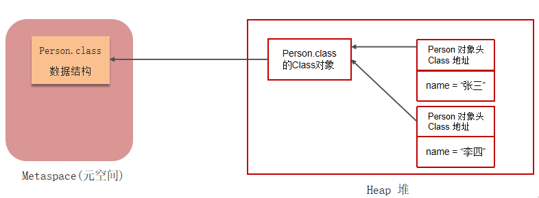
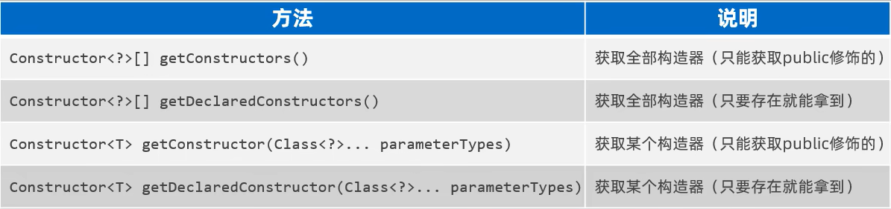
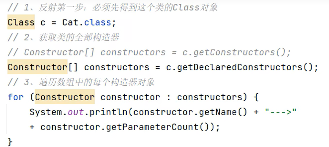
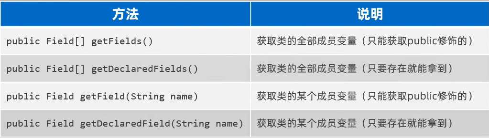
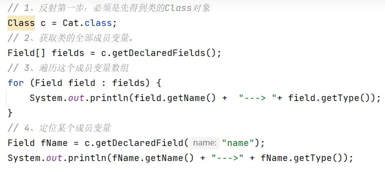

**反射：JAVA提供的代码控制代码的超能力**

#### 原理

- 流程

  当Java程序运行时，**JVM首先将类的字节码加载到方法区**，存储类的静态元数据信息（如字段、方法、父类等结构），同时**在堆区生成一个唯一的`Class`**

  **对象**作为该**类的动态访问入口**。反射操作时（如`Class.forName()`或`getMethod()`），是通过**堆区的`Class`对象定位方法区**的元数据，再通过字节码指

  令完成方法调用或字段访问。

  

- 实例

  -  获取构造器

    

    

  - 获取变量

    

    