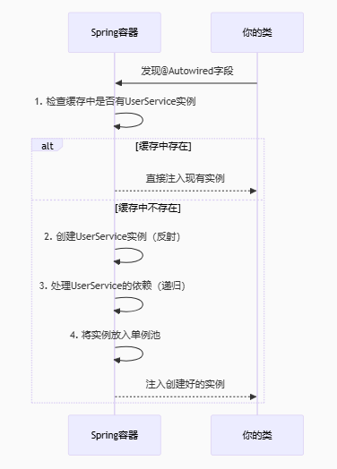

#### 什么是注解？

注解是Java代码里的**特殊标记**，**作用是让其他程序根据注解信息来决定怎么执行该程序。**

注意：注解可以用在类上、构造器上、方法上、成员变量上、参数上、等位置处。

- **value**

  如果注解只有一个value属性，使用注解时，value名称可以不写


- **元注解**

  修饰注解的注解

  

- **注解的解析**

  通过反射机制判断对应位置上是否有注解，并把注解里的内容解析出来

  ```java
          //创建对象，搭配invoke使用
  		AnnotationText a = new AnnotationText();
  		//反射获取对象
          Class c = AnnotationText.class;
  		//获取对象类中的方法
          Method[] m = c.getDeclaredMethods();
          for(Method m1 : m){
              //核心：遍历方法并判断存在“MYTEXT”注解
              if(m1.isAnnotationPresent(MYTEXT.class)){
                  m1.invoke(a);
              }
          }
  ```


- **举例（模拟test注解）**

  - 初始化注解

    ```java
    @Target(ElementType.METHOD) //注解只能用在方法上
    @Retention(RetentionPolicy.RUNTIME)//一直运行
    public @interface MYTEXT {
    }
    ```

  - 新建类并使用注解

    ```java
    public class AnnotationText {
        @MYTEXT
        public void test1(){
            System.out.println("test1");
        }
    //    @MYTEXT
        public void test2(){
            System.out.println("test2");
        }
    ```

  - 解析注解

    ```java
    public static void main(String[] args) throws Exception {
        AnnotationText a = new AnnotationText();
        Class c = AnnotationText.class;
        Method[] m = c.getDeclaredMethods();
        for(Method m1 : m){
            if(m1.isAnnotationPresent(MYTEXT.class)){
                m1.invoke(a);
            }
        }
    }
    ```

    

#### 依赖注入

- **核心**

  将对象的创建和依赖关系的管理权交给Spring容器，而**非由对象自己直接new依赖。**

- **流程**

  ​	容器启动时扫描所有被`@Component`等注解标记的类，通过反射创建这些类的实例（Bean），当发现`@Autowired`或`@Resource`注解时，会从容器中查找

  匹配的依赖对象，然后将这些依赖自动注入到目标属性或构造参数中。

  ​	所有创建好的Bean会被缓存在容器的单例池（Map结构）中复用，避免重复创建，同时容器还会处理循环依赖、AOP代理等复杂场景，最终开发

  者只需声明需要什么（如`private UserDao userDao;`），而无需关心对象如何创建和组装——这种**将控制权反转给容器**的设计，彻底解耦了对象的创建和

  使用，让代码更灵活、可测试。



- **bean销毁时机**

  - 容器关闭时（如调用`context.close()`或应用正常退出）。
  - 触发`@PreDestroy`方法或`DisposableBean.destroy()`回调。