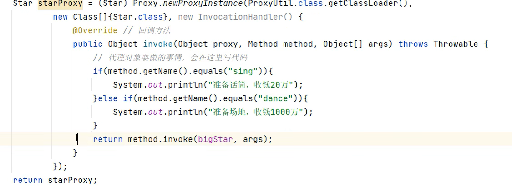
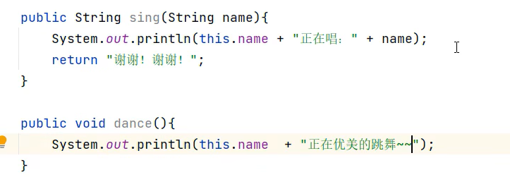

#### 什么是动态代理？

​	动态代理是一种在运行时动态生成代理类的技术，它通过**拦截目标对象的方法调用**，**在不修改原始代码的前提下插入额外逻辑**（如日志、事务等）。其核心原理是：基于接口（JDK动态代理）或继承（CGLIB代理）生成一个增强的代理类，代理类持有目标对象的引用，并在方法调用前后执行切面逻辑。

#### 动态代理有哪些方式？

JDK动态代理与CGLIB动态代理

#### 原理是什么？

JDK动态代理通过`InvocationHandler`和`Proxy`类利用反射机制在运行时为接口生成代理对象，处理方法调用。CGLIB则采用字节码生成技术，通过继承目标类创

建子类实现代理，重写方法添加额外逻辑，不支持final类或方法。

**关键词：反射机制、接口生成代理对象、字节码生成、InvocationHandler、Proxy、继承机制。**


- 简单使用

  ```java
  @Service//由Spring管理
  @Aspect//AOP使用注解
  public class AspectTest {
  	@After("execution(* com.kid..service.*.*(..))")//增强方法使用时机
  	public void doBefore(JoinPoint joinPoint) {
  		System.out.println("===doBefore==="+ joinPoint.getArgs()[O]);
  	}
  }
  ```

- 实例

  核心业务代码只需要处理需求相关的逻辑，其他的操作交给动态代理处理






- AOP实现事务

  - 当 Spring 容器创建 Bean 时，如果检测到 `@Transactional` 注解，会通过 **`BeanPostProcessor`后置处理器**为该 Bean 生成一个**代理对象**

  - **代理对象**会拦截所有标记了 `@Transactional` 的方法调用。这个代理对象会在调用目标方法之前启动事务，在方法执行完毕后根据执行结果决定是提交还是回滚事务。如果方法抛出异常，默认情况下会触发事务回滚。

    ```java
    public class TransactionProxy implements InvocationHandler {
        private Object target;
        private PlatformTransactionManager transactionManager;
    
        public Object invoke(Object proxy, Method method, Object[] args) {
            // 检查方法是否有@Transactional注解
            if (method.isAnnotationPresent(Transactional.class)) {
                TransactionStatus status = transactionManager.getTransaction(new DefaultTransactionDefinition());
                try {
                    Object result = method.invoke(target, args); // 调用原始方法
                    transactionManager.commit(status); // 成功则提交
                    return result;
                } catch (Exception e) {
                    transactionManager.rollback(status); // 失败则回滚
                    throw e;
                }
            } else {
                return method.invoke(target, args); // 非事务方法直接调用
            }
        }
    }
    ```

    

- AOP动态代理对象是在bean生成周期中的初始化后的后置处理器中生成的。

- AOP和过滤器（Filter）有什么区别？

  - AOP：拦截方法调用（业务逻辑层）。

  - Filter：拦截HTTP请求（Web层）。

    