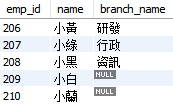
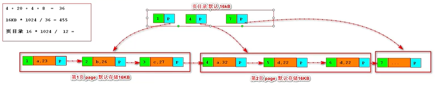
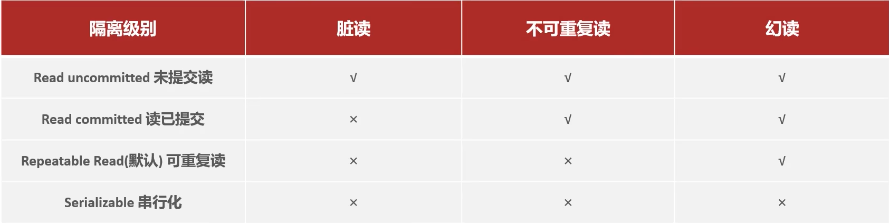
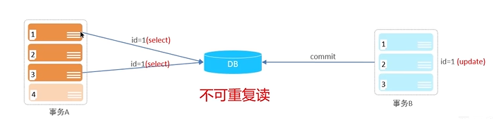
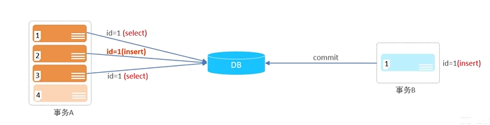
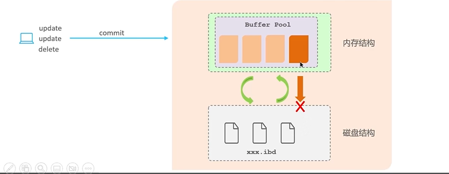
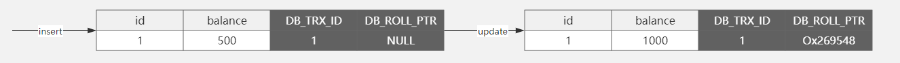
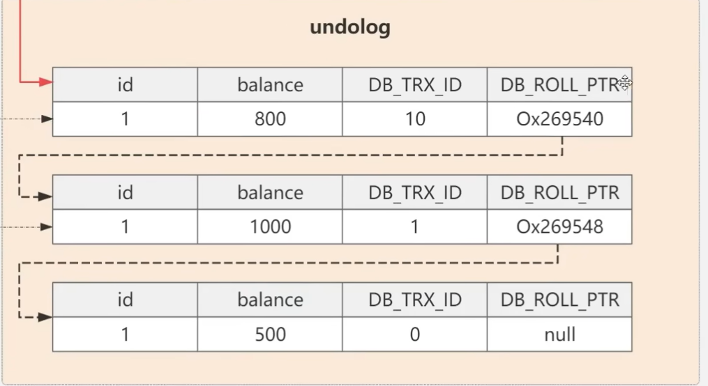
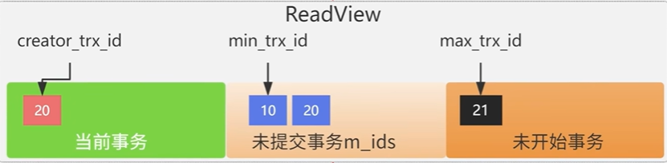

### 基础

#### 键

- 主键：在本表格中唯一的表示每一笔资料
- 外键：对应另一张表格的主键
- 一个属性可以同时是主键与外键

#### 数据形式


#### 连接

- LEFT JOIN : 无论条件是否成立，一定返回左边数据

- RIGHT JOIN : 无论条件是否成立，一定返回右边数据

- JOIN : 只返回条件成立的数据

  ```sql
   select employee.emp_id, employee.name, branch.branch_name
   from employee left join branch
   on employee.emp_id = branch.manager_id;
  ```

  

#### 索引原理



- ##### explain常见参数

  - type：all（索引失效）、index（联合索引失效，只用到自己的索引）、range、ref（联合索引成功）
  - possible_keys + key ：null证明索引失效，有东西说明可能成功
  - key_len：如果联合索引中不同说明有的跳过索引

##### 聚簇索引：键值是主键，叶节点存储行数据

##### 非聚簇索引：键值是普通索引，叶节点存储主键，需要依据主键值回表

##### 覆盖查询：不需要回表查询

```sql
--查询索引
show index from text
--创建索引
create index text_index on text(text)
```

- 注意：主键和唯一键都自动定义为索引，二者都是不能出现重复字段，但是：
  - 一个表可以有多个唯一键，只能有一个主键
  - 唯一键可以为NULL，但主键必须有值


```sql
select * from text limit 9000,10;
```

- 没有用索引，查找并抛弃前面9000行数据，返回接下来10行

- 优化：可以用索引的方式获取10条数据id，再通过id获取数据 (基于索引，B+树快找)

  - 延迟关联：

    ```sql
    select * from text t,(select text_id from text order by text_id limit 9000, 10) a where t.text_id = a.text_id;
    ```

    - 索引叶子节点是链表，按 `text_id` 有序排列。
    - 数据库从最小的 `text_id` 开始，沿着链表向后数 9000 条，然后取接下来的 10 条。
    - 这个过程是 **O(offset + limit)**，但由于是索引扫描，每条记录访问非常快。

  - 游标分页：

    ```sql
    SELECT * FROM risk_rating_alert WHERE performance_id > '12345' ORDER BY performance_id LIMIT 100;
    ```

    - 利用 `performance_id` 的索引（B+树），**直接定位到 '12345' 之后的位置**；
    - 从该位置开始顺序读取 100 条数据；
    - 返回结果。

  


- ##### 索引创建原则

  背景：

  - 数据量大且访问量大的表可以创建索引

  本身：

  - 表内常作为条件查询where、orderby、groupby的字段可作为索引

  - 字段区分度较高

  扩展：

  - 尽量使用联合索引
  
  - 索引需要维护，所以不能随便创建
  
  - 注意要用notnull约束
  
    

#### 事务


- ##### 实践1：脏读

  原count = 99

- 第一个窗口如此设置

  ```sql
  -- 开启读未提交
  SET SESSION TRANSACTION ISOLATION LEVEL READ UNCOMMITTED;
  -- 关闭自动提交
  SET autocommit=0;
  -- 开启事务
  begin;
  UPDATE book set count = 50 where id = 1;
  ```

- 另一个窗口

  ```sql
  SET SESSION TRANSACTION ISOLATION LEVEL READ UNCOMMITTED;
  SELECT * FROM sql_tutorial.book;
  ```

  此时两端都开启读未提交，1窗口修改数据后未提交 ，2窗口可读取数据，此时出现幻读

- ##### 隔离级别

  用于处理多个事务在并发的情况下对同一数据进行操作所产生的线程不安全问题

  

  - x：解决    √：无法解决

  - 脏读：读到未上传数据

  - 不可重复度：

    线程1读到数据and处理，期间线程2修改数据，导致1不可重复读

  - 幻读：
  
    线程1读id=1发现里面没数据，准备存，此时线程2存数据，线程1只能读第一次的数据，所以一直存不了，本质上是在进行操作时被其他线程影响


- 数据操作是在缓冲池上进行的，操作完后将其存到磁盘中保存（磁盘保存的最小单位是页管理(16kb)）

  

- ##### bufferPool与redo log undo log（重点）

  1. 客户端执行 sql 语句，客户端将sql语句发给 innodb 执行器执行；
  
  2. innodb 将逻辑处理与读写操作统一在内存中的 bufferpool 上执行；
  
  3. innodb**以页为单位（16kb）**和硬盘进行数据交互，将需要操作的数据从硬盘中写入bufferpool；
  
  4. 为了支持回滚，把操作前的数据存到 undolog 中，之后修改数据；
     - **undolog 实现一致性和原子性**，在数据库事务开始前，记录更新前的数据到undolog中（原子性）
     - 功能1：回滚 -- 记录逻辑日志，delete 语句对应存一条 desert，update 语句对应存相反的一条
     - 功能2：MVCC(多版本控制)
  
  5. bufferpool 中的数据被称为脏数据，只有 commit 后把数据写到硬盘上，bufferpool 的 page 才是干净的；
  
  6. **为避免丢失数据**，bufferpool 会先将**修改后的数据存入硬盘中的 redolog** 中，之后才存储数据
     - 假如传输脏页数据到磁盘时错误，可以通过 redolog 进行恢复(**持久性**)
     - bufferpool 刷盘是**随机IO**，找到不同的磁盘页修改
     - redolog 记录在哪个磁盘位置做了什么修改，刷盘时往 redolog 日志文件追加(**顺序IO**)即可
       - 保证redolog持久？redolog接收数据会先存到 redologbuffer 中，设置参数确定刷盘间隔
       - 空间有限，边记录边擦除；只能故障恢复，不能全量恢复
  
  7. 在将数据写入磁盘后，把与数据库修改相关的sql语句以二进制形式存入binlog中(不含select、show)
  
     - 追加形式，记录全量日志
  
     - 功能1：数据恢复
     - 功能2：主从复制，从库线程 a 将binlog写入relaylog中，从库线程 b 读取relaylog 文件并执行，使从库与主库保持一致


#### MVCC相关

在处理并发数据时，如果使用锁机制会影响性能，所以**通过 MVCC 无锁实现 Mysql 的事务隔离级别** 

核心：MVCC机制 是在你**查询时创建 readView 快照**，在快照中**通过undolog**进行条件判断定位到对应信息

- 三个关键：**隐藏字段、undolog日志、readview**

- 在数据库中维护 数据+3个隐藏列

  DB_TRX_ID：记录本次修改的对应事务ID

  DB_ROLL_PTR：指针，指向这条记录的上一个版本

  

  但数据库只有当前版本的数据+隐藏字段，**历史数据存在undolog中**

- undolog中维护了整个数据逻辑链

  

  要想找到本线程对应的历史数据，需要**创建 readview 对 undolog 进行查找定位**

- readView

  

  通过以上3个信息对 undolog 中数据进行条件判断

  对read_commit：

  1.数据是属于当前事务的历史数据，可以访问：D_X_I = C_T_I

  2.数据版本在当前事务生成前已提交，可以访问：D_X_I < C_T_I

  3.数据版本在事务生成后提交的，不可访问，通过指针找下一条数据：D_X_I > C_T_I

  4.这样可以实现回滚之前版本的数据，又不被多线程影响

  PS:其他隔离级别

  读未提交：无锁无MVCC

  读已提交：**每次查询都创建readview**

  可重复度：只在**第一次查询时创建readview**

  串行化：表级锁

https://www.bilibili.com/video/BV1Hr421p7EK/?spm_id_from=333.337.search-card.all.click&vd_source=35b804d0e534f391ec3606986f333f96


### 行锁and表锁


### 连接池

为保证数据传递与通信的可靠性，需要通过操作系统建立连接通道，用完关闭

在通信线程多的时候，请求也多，不能一个个去创建和关闭通道，所以有了连接池

- 连接池

  一个容器，里面**存储和管理**已打开的**连接通道**，后续线程直接**申请池中的连接通道**，线程不需要管**连接的开启与关闭**

  在mysql中，通信连接双方是java客户端 --- mysql的服务层

  


