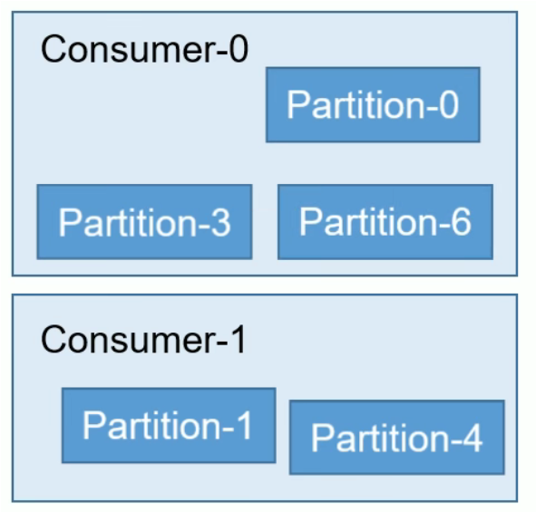

#### 是什么？

Kafka 是一个**分布式**的基于**发布/订阅模式**的消息队列

​				

#### 在哪？

Kafka 是一个分布式流处理平台，一般部署在数据中心或云环境。 Kafka 集群由多个 Kafka broker 组成， broker 可以分布在不同的服务器上，以提供高可用性和容错能力。

```cmd
bootstrap-servers: algo-stg-kafka-n1.aqumon.com:9094,algo-stg-kafka-n2.aqumon.com:9094,algo-stg-kafka-n3.aqumon.com:9094
```

Kafka 集群被部署在了 `algo-stg-kafka-n1`, `algo-stg-kafka-n2`, 和 `algo-stg-kafka-n3` 这些节点上

#### 工作流程

- Kafka 中消息是 topic 分类，生产者生产消息，消费者消费消息，都面向 topic。

- topic 是逻辑上的概念，partition是物理上的概念，每个partition 对应于一个 log 文件，log文件中存储的producer生产的数据

- Producer 生产的数据会被不断追加到该log 文件末端，每条数据都有 offset(坐标)。

- 消费者实时记录自己消费到了哪个 offse。

  

  


#### 存储机制

1. 生产者生产的消息会不断追加到 **log 文件末尾**，为防止 log 文件过大导致数据定位效率低下，Kafka 采取**分片和索引**机制，将每个 partition 分为多个 segment。每个 segment对应两个文件：“.index”文件和“.log”文件。
2. 两文件位于**一个文件夹下**，该文件夹的命名规则为：topic 名称+分区序号。eg：first-topic 有三个分区，其对应的文件夹为 first-0、first-1、first-2。

- **Partition**：Topic 的分区，实现并行处理和负载均衡（一个分区只能被一个消费者消费）。

- **Offset**：消息在分区中的唯一位置标识（消费者通过 Offset 记录消费进度）。

  


#### Kafka 生产者

##### 分区策略

- 指明 partition 的情况下，直接将指明的值直接作为 partiton 值；
- 没有指明 partition 值但有 key 的情况下，将 key 的 hash 值与 topic 的 partition数进行取余得到 partition 值；
- 既没有 partition 值又没有 key 值的情况下，第一次调用时随机生成一个整数（后面每次调用在这个整数上自增），将这个值与 topic 可用的 partition 总数取余得到 partition 值，也就是常说的 round-robin 算法。

##### 数据可靠性

- topic 的每个 partition 收到producer 发送的数据后，需要向 producer 发送 ack
  


#### Kafka 消费者

##### 消费方式

- consumer 采用 pull（拉）模式从 broker 中读取数据。
  - pull 模式不足：kafka 没有数据时，消费者会陷入循环中，一直返回空数据。所以Kafka 的消费者在消费数据时传入**时长参数 timeout**，如果当前没有数据可供消费，consumer 会等待一段时间之后再返回，这段时长即为 timeout。

##### Group ID 

- 消费者组的唯一标识。
- 同一个 group.id 下的所有消费者共享 offset，共同消费一个 topic。
- 不同的 group.id 彼此独立消费数据，互不影响。
- 注意，不同设备使用同一个Group ID会发生竞争关系。

##### **client.id** 

- 主要用于日志和监控，不需要改

```java
@KafkaListener(id = ReceiverProperties.PROPERTIES_DATABUS_REAL_GROUP_ID, 
			   topics = ReceiverProperties.PROPERTIES_DATABUS_TOPIC_NAME)
```

注解的作用是：定义了一个 Kafka 消费者，使用指定的 group.id 去监听指定 topic 的消息。


1. **仍然使用 `poll()`**：`KafkaMessageListenerContainer` 内部会创建 `KafkaConsumer` 并调用 `poll()`
2. **自动线程管理**：Spring 帮你管理消费者线程，不需要手动写 `while(true)`
3. **事件驱动风格**：你只需要关注“收到消息后做什么”，不用关心“怎么拿消息”

##### 如何成功连接kafka？

- 配置 Kafka **集群地址** 。

  

  - 分别代表了集群中的三个不同的 broker，提高连接可靠性。如果某个 broker 不可用，客户端会尝试连接到列表中的下一个 broker。

- **Topic**：确定监听的消息来源topic。

- **Group ID**： group.id是身份验证的重要id，不同设备使用同一个Group ID会发生竞争关系。

  

##### 分区分配策略

一个 consumer group 中有多个 consumer，一个 topic 有多个 partition，涉及到 partition 的分配问题。
Kafka 有两种分配策略，一是 RoundRobin，一是 Range。

- **RoundRobin - 轮询**

  轮询的方式分配分区时，不是基于同一个topic去分，是把所有分区看成一个整体，TopicAndPartition类代表着所有topic的分区，TopicAndPartition会根据分区对象的**hash值排序，把排完序的分区轮询分配给消费者**。

  **逻辑：**

  - 将所有订阅的 Partition 按 Topic + Partition 排序

  - 将所有 Consumer 按字典序排序

  - **轮询方式**分配每个 Partition

    | Consumer | 分配的 Partition       |
    | -------- | ---------------------- |
    | C0       | orders-P0, payments-P1 |
    | C1       | orders-P1, payments-P0 |

  **why?**

  - **优点**：分配更均匀
  - **缺点**：
    - 要求所有 Topic 的 Partition 数量相同
    - 如果 Consumer 只订阅部分 Topic，可能分配不均

  

  

  

  

- **Range -  按序分配**

  默认的消费者分区分配方式。基于同一个主题，分区数 / 消费组里的消费者数均分下去，如果除不均，会有一个消息者多分配分区。面向topic

  **逻辑：**

  - 将每个 Topic 的 Partition 按序排列
  - 将 Consumer 按字典序排列
  - 将 Partition **连续地、按范围**分配给 Consumer
  
  | Consumer | 分配的 Partition |
  | -------- | ---------------- |
  | C0       | P0, P1           |
  | C1       | P2, P3           |
  
  **why?**
  
  - **优点**：简单直观
  -  **缺点**：容易造成**不均衡**，尤其是 Consumer 数量变化时
  
  
  
  
  
  
  
  
  
-  **StickyAssignor - 尽量不变**

  适用所有场景，尤其是希望**最小化 Rebalance 影响**

  **逻辑：**

  - 负载均衡
  - 尽可能保持**原有分配不变**

  **eg：**

  - C0: P0, P1

    C1: P2, P3

  - 现在 C2 加入

  StickyAssignor 会尝试：

  - 保持 C0 和 C1 的现有分配
  - 把 P4, P5 分给 C2

  **why？**

  **优点：**

  - 分配均衡

  - Rebalance 时变动最小，**减少消费中断**

  **缺点**：算法复杂，计算开销略高

##### **触发时机**

消费者组里的消费者个数发生变化时。


#### **Offset**

类似数组中的索引

- **Offset** 是 Kafka 为每条消息在分区（Partition）中分配的唯一序号（从 0 开始递增）。
- 消费者通过 Offset 记录消费进度，下次启动时从上次的位置继续消费。

##### 维护

 consumer 在消费过程中可能出现断电宕机等故障，consumer 恢复后，需要**从故障前的位置的继续消费**，所以 consumer 需要**实时记录自己消费到了哪个 offset**，以便故障恢复后继续消费。


#### 高效读写

##### 顺序写磁盘

Kafka 的 producer 生产数据，要写入到 log 文件中，写的过程一直追加到文件末端，为顺序写。同样的磁盘，顺序写能到 600M/s，而随机写只有 100K/s。这与磁盘的机械机构有关：顺序写很快，是因为**省去了大量磁头寻址的时间**。


#### 事务

##### Producer 事务

为实现跨分区跨会话的事务，需要引入一个**全局唯一的 Transaction ID**，并将 Producer获得的**PID 和Transaction ID 绑定**。这样当Producer 重启后就可以通过正在进行的 TransactionID 获得原来的 PID。

为了管理 Transaction，Kafka 引入了一个新的组件 Transaction Coordinator。Producer 就是通过和 Transaction Coordinator 交互获得 Transaction ID 对应的任务状态。Transaction Coordinator 还负责将事务所有写入 Kafka 的一个内部 Topic，这样即使整个服务重启，由于事务状态得到保存，进行中的事务状态可以得到恢复。

##### Consumer 事务

对于 Consumer ，事务的保证就会相对较弱，尤其时无法保证 Commit 的信息被精确消费。这是由于 Consumer 可以**通过 offset 访问任意信息**，而且不同的 Segment File 生命周期不同，同一事务的消息可能会出现重启后被删除的情况。


#### 总览

​					

对 kafka 消息队列，整体结构是：**producer -> broker -> consumer**；其中 broker 集群内包含 topic 和 partition ，其中 topic 是逻辑概念，partition 是物理概念，内部划分为多个 segment 文件(默认 1GB 或 7天，超过会清理最早数据)，维护log，index文件，存储效果是类似数组，**通过offset锚定**。

- **安全：**
  - producer 传输数据到 kafka 时，传输给每个 part 的 leader 节点，**不同 broker 的 follower 节点会同步到 leader 节点的数据**；为保证传输完整，可以配置 ack 为 all，当所有 **isr - follower 副本复制到数据**后，才 ack 通知 producer；
  - consumer 消费数据时，也会出现数据安全问题，比如重复消费，场景是当前消费者宕机，负责的 part 交给其他消费者**(触发 rebalance**)，因为默认为自动上传 offset，导致处理和上传不同步，所以新消费者消费已消费数据。解决方法是，配置为**手动上传 offset** ，每次业务模块结束时**异步上传 offset**， 并且 finally 一个**同步上传兜底**。
- **可用：**
  - broker 集群中每个 partition 有多个副本，其中一个为 leader，其余为 follower。**所有follower 主动从 leader 拉取消息**。其中**isr 是与 leader 保持同步的副本**。当 leader 宕机时，kafka 会从 isr 中选举新的 leader，保证数据不丢失。
- **性能：**
  - linux 存储结构分为**用户空间，内核空间和硬盘**；kafka 因为**分区结构**，不受单台服务器限制，可以处理更多数据，并且其存储方式是顺序读写，在log、index后**追加文件，相比于随机存储，速度更快**，其存储策略是通**过页缓存，缓存到内存中**，再委托内存写入磁盘，减少磁盘IO；在 consumer 读取数据时，数据链路：**磁盘 -> 内存 -> 网卡**；不经过用户空间进一步提升性能。
  - 内存：暂时存放CPU运算数据，断电不保存；所有程序(进程)都在内存中运行
  - 硬盘：存储数据的设备


#### 实际应用

1. 发送URL命令到dev环境程序

   ```cmd
   http://192.168.10.90:15558/restore-offset?offset=7083363692
   ```

2. Controller识别到url，执行操作

   ```java
   @PostMapping("/restore-offset")
   public String restoreOffset(@RequestParam("offset") Long offset) {
       databusQuoteListener.rewindAllOneRecord(offset);
   ```

   

3. - 获取所有 TopicPartition （包含 topic 名称和分区编号）和 SeekCallback（动态地调整消费 offset）
   - 遍历并筛选目标 topic 的分区
   - 对每个匹配的分区执行 seek(offset)
   - 下次 poll() 时从此 offset 开始读取

   ```JAVA
   public void rewindAllOneRecord(Long offset) {
       getSeekCallbacks()
               .forEach((tp, callback) -> {
                           if (tp.topic().equals(receiverProperties.getTopicDatabusQuote().getName()))
                               callback.seek(tp.topic(), tp.partition(), offset);
                       } );}
   ```

注意，如果要进行本地测试，192.168.10.90改为本地IP


#### 项目配置

##### 全局配置

```yaml
spring:
  profiles:
    active: @profileActive@  # 动态激活的环境
  application:
    name: streaming-sinker-smart-fund  # 应用名称
  kafka:
    producer:
      bootstrap-servers: ${qeks.kafka.bootstrap-servers}  # Kafka集群地址（从环境变量或profile中注入）
      acks: all  # 生产者需等待所有副本确认消息
      key-serializer: org.apache.kafka.common.serialization.IntegerSerializer  # Key序列化方式
      value-serializer: org.apache.kafka.common.serialization.ByteArraySerializer  # Value序列化方式（二进制数据）
...
      auto-offset-reset: latest  # 无偏移量时从最新消息开始消费
    listener:
      type: batch  # 批量消费模式（提高吞吐量）
```


##### 本地环境

```yaml
spring:
  profiles: local
  datasource:
    url: jdbc:log4jdbc:postgresql://192.168.10.132:5532/smart_fund_2_infra  # 带日志的JDBC驱动（方便调试SQL）
...
    jdbc.sqltiming: info  # 打印SQL执行时间（开发时调试用）
qeks:
  kafka:
    bootstrap-servers: algo-stg-kafka-n1.aqumon.com:9094,...  # 测试环境Kafka地址
xxl.job:
  adminAddresses: https://algo-stg.aqumon.com/...  # 调度中心地址（测试环境）
```

##### 服务端口

```yaml
server:
  port: 15558  # 主应用服务端口（对外提供业务接口）
management:
  endpoints:
    web:
      exposure:
        include: "*"  # 暴露所有监控端点（如health、metrics、info等）
      base-path: /kowloon-${spring.application.name}  # 监控端点的URL前缀（例如：/kowloon-streaming-sinker-smart-fund/actuator）
  endpoint:
    health:
      show-details: always  # 显示健康检查的详细信息（如数据库、磁盘状态）
  metrics:
    tags:
      application: ${spring.application.name} # 在监控指标中添加应用名称标签（Prometheus区分）
  server:
    port: 17558  # 管理端点独立端口（与业务端口分离，增强安全性）
```

##### kafka主题

```yaml
qeks:
  kafka:
    topic-databus-quote:
      name: databus.quote  # Kafka主题名称（实际订阅/生产的消息队列）
      group-id: ${spring.application.name}-databus-quote-group-${spring.profiles}-111  # 消费者组ID
```

项目启动时，Maven 资源过滤通过@profileActive@判断当前环境，并带入对应参数

```cmd
spring-profiles-active: @profileActive@ 
    group-id: ${spring.application.name}-databus-quote-group-${spring.profiles}
    ...
```

针对不同profile（环境），系统会找到对应字段，进行拼接

```cmd
spring:
  profiles: local
  ...
  group-id: ${spring.application.name}-databus-quote-group-${spring.profiles}
```

把yml破解后的字段注入注解，连接kafka

```cmd
@KafkaListener(id = ReceiverProperties.PROPERTIES_DATABUS_REAL_GROUP_ID, 
			   topics = ReceiverProperties.PROPERTIES_DATABUS_TOPIC_NAME)
  ...
    public static final String PROPERTIES_DATABUS_TOPIC_NAME = "${qeks.kafka.topic-databus-quote.name}";
    public static final String PROPERTIES_DATABUS_REAL_GROUP_ID = "${qeks.kafka.topic-databus-quote.group-id}";
```

