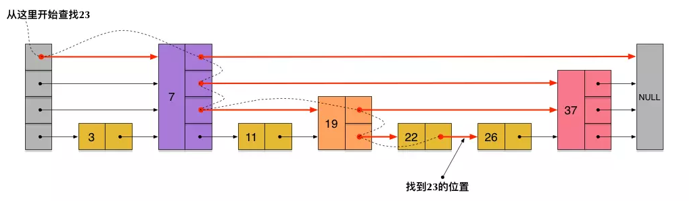

#### redis是什么？

一个高性能，支持多种数据类型，各种缓存淘汰策略，并提供一定持久化能力的缓存服务。

#### 为什么用redis？

- **内存存储：**Redis是**基于内存存储的非关系型数据库**，MySQL是基于磁盘存储的关系型数据库。由于**内存存储速度快，Redis能够更快地读取和写入数据**，而无需像MySQL那样频繁进行磁盘I/O操作。

- **简单数据结构：**Redis是**基于键值对存储**数据的，支持简单的数据结构，因此在某些场景下Redis的数据操作更为简单高效，比如Redis用哈希表查询，只需要O1时间复杂度。

- **线程模型：**Redis采用**执行命令时单线程**模型可以避免了多线程之间的竞争，省去了多线程切换带来的时间和性能上的开销，而且也不会导致死锁问题。

  | 模块                     | 是否多线程      | 说明                                      |
  | ------------------------ | --------------- | ----------------------------------------- |
  | **网络 I/O 读写**        | ✅ 多线程        | 使用多线程处理网络数据的读取和发送        |
  | **命令执行（核心逻辑）** | ✅ 单线程        | 所有命令在一个线程中串行执行，保证原子性  |
  | **持久化（RDB/AOF）**    | ✅ 多进程/多线程 | `fork()` 子进程做 RDB，AOF 重写也是子进程 |

#### redis底层的数据结构

Redis的存储结构是MAP(key - value)，其中支持的数据类型：String（字符串)，Hash(哈希)，List（列表)，Set(集合)、Zset(有序集合)、stream流

##### ZSET实现原理

Redis 的 ZSET（SortedSet，有序集合）同时支持有序性和唯一性的数据结构，每个元素关联一个分数（score），并按分数排序。

ZSET通过**跳表（SkipList）和哈希表（Dictionary）**的组合实现，其中**跳表负责维护有序性**，**哈希表负责快速查找元素是否存在**。而B+树是另一种常见的平衡树结构，广泛用于数据库（如MySQLInnoDB引擎）。

##### Redis选择跳表而非B+树？

- 跳表

  

  - 多层**有序链表**，**上层是下层的快速通道**

    查找方式：从最上层开始查找对应数据范围，通过下降层级快速定位目标

  - 通过概率随机确定节点高度

  - 优点：
    - 实现简单：**无需复杂的树平衡**操作（如旋转）。
    - 动态性：插入和删除操作无需调整整体结构，仅需**修改局部指针**。
    - 内存友好：在小规模数据下**比B+树更节省空间**。
  - 缺点：
    - 空间开销：层数增加时指针数量可能较多，但通过随机层数生成算法可控制。
    - 范围查询效率：需遍历链表，而B+树的指针顺序访问可能更快。
  - 总结：Redis 作为**内存数据库**，**跳表更契合**其设计目标
    - 跳表更适合在内存中使用，快速定位元素，**内存占用低**
    - B+数更适合在磁盘中存储，**通过层级遍历减少IO次数，牺牲存储空间**（维护大量指针）

#### 线程

##### 单线程接收

Redis单线程指的是【接收客户端请求 -> 解析请求 -> 进行**数据读写等操作** -> 发送数据给客户端】这个过程是由单线程来完成。

##### 多线程处理

redis在进行数据淘汰策略与消息队列时使用多线程技术。

对数据的GET、SET方法是单线程的，其他额外步骤由其他线程负责，所以需要保证原子性（通过lua脚本）

- lua脚本

  由于Lua脚本在Redis中是**从头到尾连续执行**的，在脚本执行期间**不会被其他命令打断**，因此可以用来实现复杂的业务逻辑而不必担心并发问题。

#### 内存处理策略

- 过期删除

  对已过期键值对进行删除

  - 惰性删除：给缓存数据**添加过期时间**，在访问时先判断过期时间，若**过期直接删除**(后续会查找mysql数据并返回新版)（占用内存）
  - 定期删除：每隔特定时间抽取部分key，检查是否过期（占用CPU）

- 内存淘汰

  内存满了后触发，依据策略淘汰一部分内存，主要是以下两大策略：

  - **LRU：**最近最少使用数据，将其删除
  - **LFU：**最少频率使用的数据，将其删除
  - 范围（volatile：设置了过期时间；allkey：所有数据）

#### 持久化

- RDB(快照)

  **生成快照**，通过异步子线程定期将内存数据持久化到磁盘文件，**优点是恢复快，缺点是会有数据丢失(快照有时间间隔)**

- AOF(追加)

​       以**追加**的方式，把操作命令写入磁盘，重启时**逐一执行命令**来进行恢复，优点是**保存完整**，缺点是**恢复慢(逐一执行)**

#### 分布式锁

