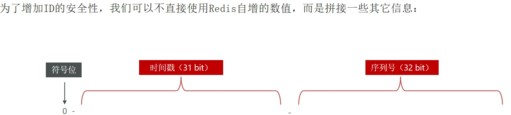
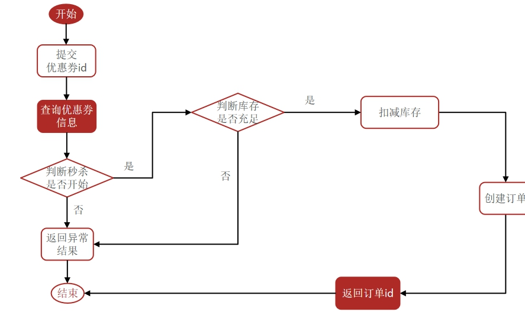
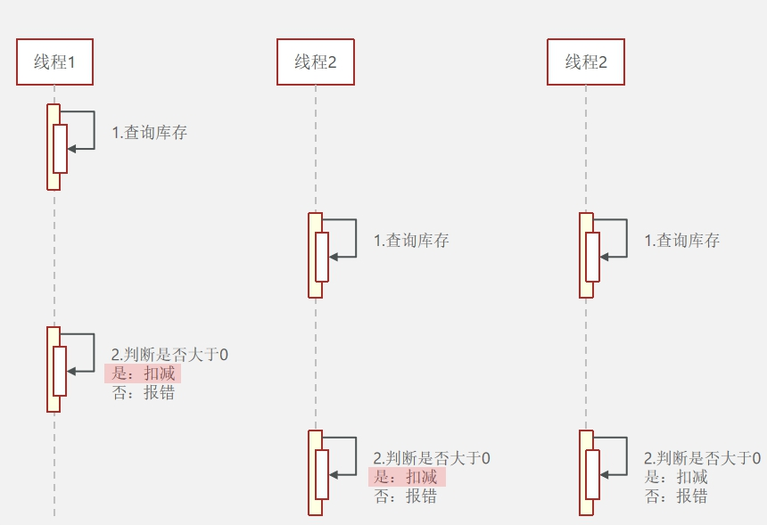
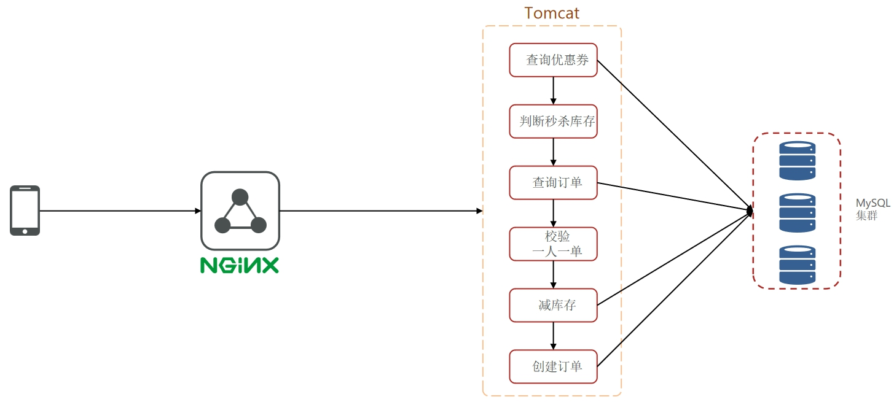

#### ID生成



- 符号位：1bit，永远为0
- 时间戳：31bit，以秒为单位
- 序列号：32bit，按照秒计数器变化

#### 秒杀卷



- 秒杀是否开始或结束，如果尚未开始或已经结束则无法下单
- 库存是否充足，不足则无法下单

#### 超卖问题



对于多线程安全问题，常见解决方案是加锁

- 悲观锁

  (认为线程安全一定发生)，在操作(插入)数据前获取锁，确保线程串行执行

  - 插入原本没有的值使用悲观锁

  - synchronized、lock
  - 场景：同一设备只能抢一张卷
    - 给用户ID加锁，注意synchronized(userID.toString().intern())，防止返回不同对象

- 乐观锁

  (认为线程安全问题不一定发生)，不加锁，只在**更新数据**前判断**数据是否已被修改**

  - 没修改：安全的，自己更新数据

  - 已修改：出现安全问题，重试或异常

  - CAS法：按照数值变化情况判断是否安全

  - ```sql
    set stock = stock - 1 where id = 10 and stock = num
    ```

    - 缺点：太谨慎，请求同时因一个不同而全部失效
    - 改进：借助数据库锁，(当1票仍有多人抢的时候会排序)

    ```sql
    set stock = stock - 1 where id = 10 and stock > 0 
    ```

  


#### 秒杀总结

- 核心业务

  - 扣减优惠卷库存
  - 抢购的优惠卷信息写入订单，完成订单创建

- 业务限制

  - 判断库存充足，不能出现超卖现象
  - 限制用户只能下一单

  

#### 秒杀优化

- 优化思路

  - 把同步下单改为异步下单(redis判断资格 + 异步下单)
  - 解决队列内存限制 + 数据安全问题

- 具体过程

  -  在tomcat中接收到用户请求

    1. 执行lua脚本，在redis中校验用户是否有购买资格(库存 + 一人一单)，返回结果标志
    2. 主程序根据标志判断
       - 否：返回异常
       - 是：保存优惠卷ID + 用户ID + 订单ID 存入阻塞队列，返回订单给用户
         - 异步线程将队列信息存入数据库

  - 基于stream结构作为消息队列，实现异步秒杀下单

    1. 创建stream类型的消息队列stream.orders

    2. 修改下单的lua脚本，在认定有抢购资格后，向orders中添加信息(voucherID、userID、orderID)

    3. 项目启动，开启线程获取orders中的信息，完成下单 

    4. 获取信息 > 判断信息 > null - 重新获取|有- 解析数据  >  下单  >  确认

       catch抛出异常：获取pending - list中数据  >  判断 ...


#### 一人一单

在一人一单实现时，出现了事务失效：

在同一个类中调用事务管理的方法 -- 详见 17.50

https://www.bilibili.com/video/BV1NV411u7GE?spm_id_from=333.788.videopod.episodes&vd_source=35b804d0e534f391ec3606986f333f96&p=31

- 原因：
  - Spring 使用 AOP（面向切面编程）来实现 @Transactional 注解的功能。
  - 当你调用一个带有 @Transactional 注解的方法时，Spring 实际上会通过**动态代理对象来拦截该方法调用，并为其添加事务管理逻辑**。
  - 问题在于：当你在**同一个类中直接调用一个方法时，调用并不会经过代理对象**，而是**直接通过当前对象的实例进行调用。因此，事务拦截器不会生效**。所以事务不生效
- 解决方法：
  - 确保调用 @Transactional 方法时通过 Spring 的代理对象进行调用
    - 使用 AopContext.currentProxy() 获取当前代理对象


#### 消息队列

包含三个角色：消息队列、生产者、消费者

 