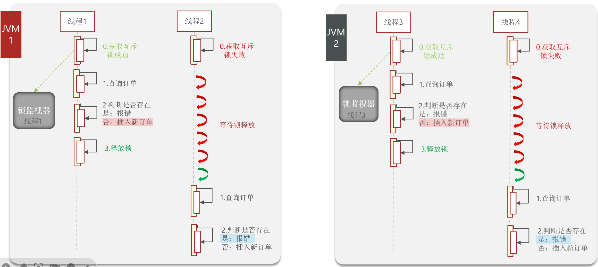
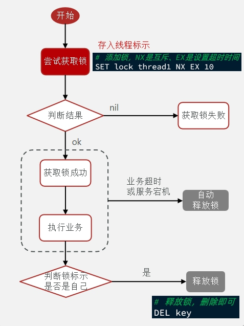
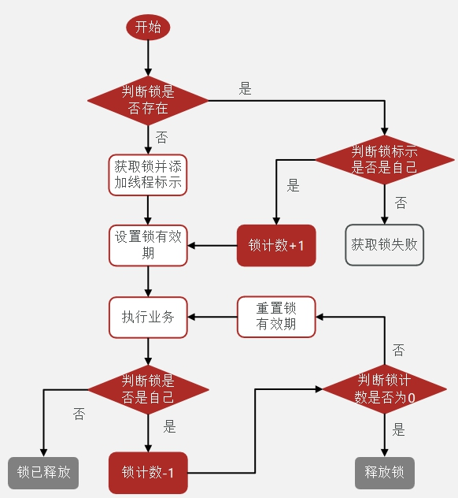

### 分布式

#### 概念

- 分布式指一组独立的计算机（通常称为节点）通过网络互相连接并通信，共同完成一个或多个任务，从外部来看就像一台计算机一样工作。
  - 并发性：多个计算资源同时处理不同的任务或任务的不同部分。
  - 缺乏全局时钟：在分布式系统中，由于各节点可能有不同的本地时间，并且没有统一的时间基准，因此很难定义事件发生的绝对顺序。
  - 独立故障：每个节点都可能独立地发生故障，而其他节点可能继续正常运行。这就要求系统具有容错能力。
  - 可扩展性：可以通过增加更多的机器来处理更高的负载或者更大的数据量，从而实现水平扩展。

#### 问题

在点评项目中，为解决一人抢多张秒杀卷的问题，需要采用锁。

但是锁只能管理一个JVM下的程序，在分布式或集群环境下，不同设备同时收到同一人请求仍然会放行



#### 分布式锁

分布式锁不是用来解决“数据库死锁”的，而是用来解决“**跨服务的共享资源竞争**”或“全局唯一操作”问题的。

在分布式系统或集群模式下多进程可见并且**互斥**的锁。

- 三种实现：Mysql(本身互斥锁)、Redis(setnx命令)、Zookeeper

- redis锁 -自己实现

  - 创建锁对象

  - 获取锁：setnx，互斥
  - 释放锁：超时释放  (原子性：要么都成功，要么都失败)

  ```sql
  SET lock thread1 NX EX 10 
  ```

  - 尝试获取锁：失败不等待，直接返回false

  -  注意在判断与操作中保证原子性(用事务)

  - 总实现思路

    - 利用 `set nx ex`获取锁，设置过期时间，保存线程标识
    - 释放锁时优先判断线程标识是否与自己的一致，一致则删除
    - `set nx`满足互斥性
    - `set ex`保证故障时锁依然释放，避免死锁，提高安全性
    - Lua脚本 保证判断与删除锁的原子性
    - 利用redis集群保证高可用和高并发

    

- redission锁 - 成熟框架

  在redis基础上实现的分布式工具的集合。

  redis锁

  - **不可重入**：**同一个线程无法获取同一把锁**，A线程获取锁，调用B，B无法获取锁
  - 解决方法：再次获取锁时判断是不是同一线程，定义state记录获取锁次数
  - 注意：保证获取锁和释放锁的原子性

  

  - redisson分布式锁原理
    - 可重入：利用hash结构记录线程id和重入次数（key：锁的字段，field：线程ID，value：重入次数）(思想类似sy,reen锁)
    - 可重试：利用信号量和pubsub功能实现等待、唤醒、获取和失败的重试机制
    - 超时续约：利用watchDog，每隔一段时间(releaseTime/3)，重置超时时间
    - multilock，多个独立节点，必须所有节点获取锁才能操作(解决主从模式的问题)

- 自动拆箱安全风险

  - 返回要求是基础类型，return包装类(对应值，null)时，若值为null，会报错

   

### 并发

核心：解决多线程争夺**共享资源**时的**可见性、有序性、原子性**

操作系统通过内存模型定义了规范（内存模型）；考虑到不同环境的规范不同，JAVA 自己设计了一套内存模型(JMM)

#### JMM（内存模型）

定义了主存如何与工作内存交互（**主存：进程独属的内存空间；工作内存(抽象) = 线程所属的寄存器 + 缓存**）

规范：

主存加锁 -> 读主存数据到工作内存 -> 写工作内存参数 -> 执行引擎 -> 结果赋给工作内存 -> 主存 -> 赋给主存数据 -> 解锁

##### volatile

保证有序性（插入内存屏障）、可见性；实现：**直接在主存中读写**

##### happen before

A happen before B：A 结果在 B 中可见

synchronized 保证三性；volatile 保证有序性可见性；CAS 保证原子性

#### 关键指标

- **TPS (Transactions Per Second)**：每秒**事务处理**量。

  ​	事务指的是客户机向服务器发送请求然后服务器做出反应的过程。包括用户请求、服务器内部处理以及服务器返回响应给用户。TPS可以理解为**系统每秒钟能够处理的完整业务流程的数量**。不仅涵盖了简单的查询操作，还包括了数据修改（增删改）等复杂的业务逻辑处理。

- **QPS (Queries Per Second)**：每秒**查询**率。

  ​	指一台服务器每秒能够响应的查询次数，用于衡量查询服务器在规定时间内所处理流量的能力。**QPS主要针对的是查询操作**，比如数据库中的每秒执行查询SQL的次数，并不包含复杂的业务逻辑处理。

- **JMeter监听**
  - TPS 为每秒完成的请求数（请求成功并返回响应）。JMeter 中通过统计**吞吐量来表示 TPS**。
  - QPS 为每秒发出的查询次数。如果一个事务中包含多个查询，**QPS 可能会大于 TPS**。


#### 锁

思想：共享资源只有一份，强制让多个线程互斥访问

#### synchronized锁

##### 1. **对象头与监视器锁（Monitor Lock）**

在 JVM 中，每个对象都有一个对象头，对象头包含一些元数据信息以及一个指向**监视器锁（Monitor）**的指针。监视器锁是一种同步机制，它**允许线程获取锁、释放锁，并且在等待锁时进入等待状态**。

- Monitor：锁的核心，包含：
  - `owner`：当前持有锁的线程
  - `entryList`：等待获取锁的线程队列（Blocked）
  - `waitSet`：调用 `wait()` 后进入的等待队列

- **无竞争情况**：如果没有任何线程竞争该锁，那么获取锁的过程是**非常轻量级**的，通常只需要简单的原子操作。
- **有竞争情况**：如果有多个线程试图同时获取同一个锁，则其中一个线程会成功获取锁，其他线程会**被阻塞**并放入等待队列中，直到持有锁的线程释放锁为止。

##### 2. **偏向锁、轻量级锁和重量级锁**

为了优化性能，JVM 提供了不同的锁状态，这些状态根据锁的竞争程度动态调整：

- **偏向锁**：适用于**无竞争**情况，旨在减少不必要的 CAS操作。当一个线程第一次访问同步代码块时，JVM 尝试**将对象头中的锁标志位设为偏向当前线程的状态**。这意味着**后续对该锁的访问不需要进行额外的同步操作**，除非有另一个线程试图获取该锁。
- **轻量级锁**：当存在**少量竞争**但并不频繁时。在这种情况下，JVM 会尝试通过**CAS自旋的方式获取锁**，而不是立即阻塞线程，从而避免上下文切换带来的开销。
- **重量级锁**：当锁的**竞争非常激烈（线程多次抢锁失败、竞争线程增多）** 时，JVM 会将锁**升级为重量级锁**。此时，所有竞争的线程都将**进入阻塞状态，直到锁被释放**。重量级锁涉及到操作系统级别的线程调度，因此其开销较大。

##### 为什么慢

- 电脑存储空间包含 用户态 - 内核态(内存 + 缓存) - 磁盘
- 用户态可以执行代码，访问内存，不能管理线程，只有操作系统内核可以调度线程(阻塞、唤醒)，具体是系统将线程设为阻塞，加入等待队列
- 所以阻塞和唤醒需要操作系统在内核态中进行调度

##### 三大特性

| 特性       | 说明                                                         |
| ---------- | ------------------------------------------------------------ |
| **原子性** | 同一时刻只有一个线程执行临界区代码                           |
| **可见性** | 一个线程修改共享变量，其他线程能立即看到（通过 **锁的释放与获取** 触发内存屏障） |
| **有序性** | 锁的获取与释放相当于 **内存屏障**，禁止指令重排              |


##### 3. **JVM 和操作系统层面的支持**

- **CAS 操作**：乐观地认为没有线程和它竞争，相等：修改状态值访问共享资源；不相等：自旋

  在低竞争场景下，JVM 使用 CAS 操作来高效地管理锁的状态转换。CAS 是一种原子操作，它比较内存位置的内容与预期值，若相同则更新该位置的内容，否则不作任何操作。

  - 注意：CAS适用于**线程竞争少，执行时间短**的场景，因为一直自旋导致**CPU核空转，处理不了其他业务，浪费资源**
  - CAS涉及比较再交换，如何保证原子性：调用**unsafe类**中的方法，由**native修饰的本地方法**，C++ 依赖**CPU的硬件指令(锁定总线避免共享资源或锁定缓存行)**，所以**CAS也加了悲观锁**

- **操作系统线程调度**：在高竞争场景下，JVM 需要依赖操作系统的线程调度机制来管理锁的竞争。例如，在 Linux 系统上，这可能涉及使用 futexes（Fast User-Space Mutexes）等机制来实现高效的线程阻塞和唤醒。

##### 4.预防死锁

触发条件：

互斥、不可剥夺、持有等待、循环等待

解决：

1. 资源分配顺序：确保所有线程按照相同的顺序请求资源，避免循环等待。

2. 超时机制：设置资源请求的超时时间，超时后强制释放资源。


#### 延伸

- AtomicInteger：Integer：int变量，Atomic：**可见性 - volatile；原子性 - CAS** ；所以是 volatile 修饰的 int 变量，需要修改时通过 CAS 修改


#### 读写锁

##### ReentrantReadWriteLock (读写锁)

- 可 读读

- 不可 读写 写写

- state 非零：有锁

  高16位：读锁，后续 + 1；对应线程的threadlocal + 1
  低16位：写锁，排入队列