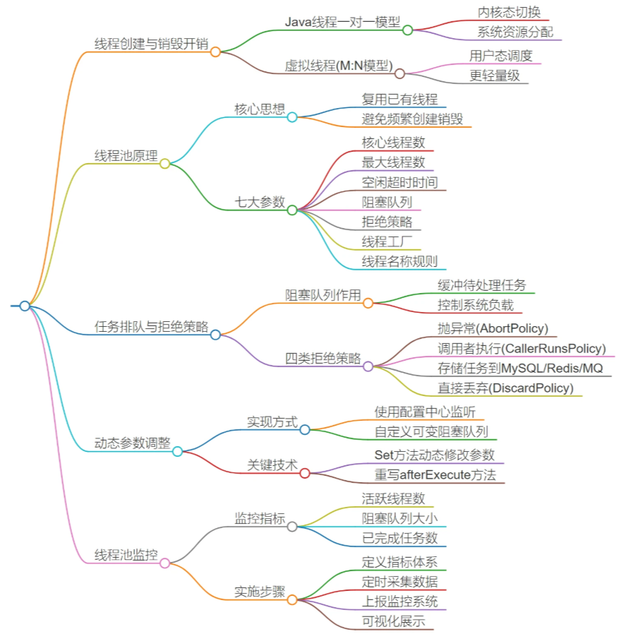
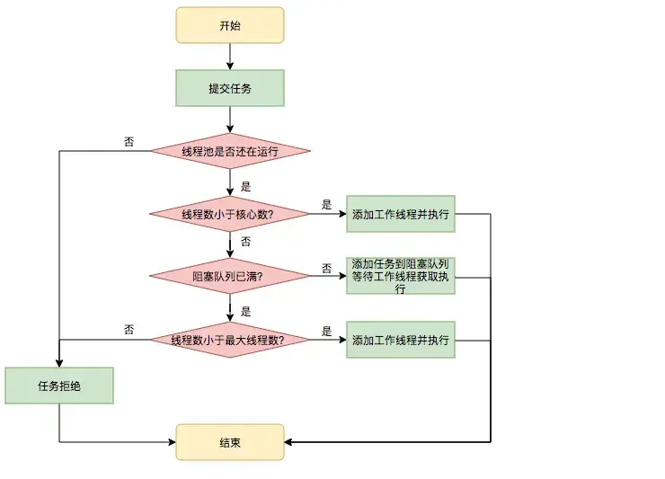
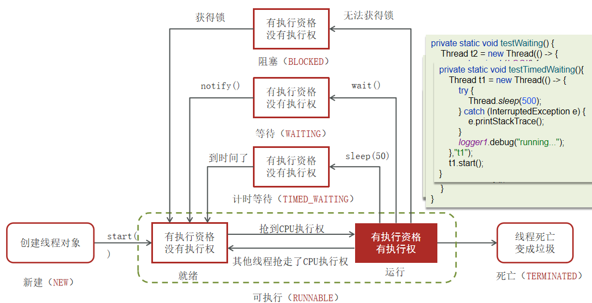

- 进程是正在运行程序的实例(浏览器1，qq，游戏)
  - 进程包含线程，每个线程执行不同任务
- 不同进程划分不同的内存空间，同一进程内线程共享内存
- 线程切换比进程切换消耗更低，更轻量

- 并发：单核CPU**微观串行**处理，**宏观并行**的；这种**多线程轮流使用CPU**的做法叫并发

- 并行：多核CPU下，多个任务**真正同时运行**

- JMM (java memory model)：对共享内存中不同线程读写的操作规范
  - 其他线程工作内存通过CAS(乐观锁思想)同步主内存 

#### ThreadLocal

思想：把资源复制多份，每个线程一个副本（static 修饰，所有线程共享）

为每个线程提供独立的变量副本，避免线程安全问题，实现线程隔离。 它常用于存储线程上下文信息，比如数据库连接、用户登录信息。

**存储在堆中**，使得数据**能在本线程中跨方法使用**

- 每个 `Thread` 对象有一个 `threadLocals` 字段
- `ThreadLocalMap` 线程私有，是一个**自定义的哈希表**，维护一个Entry数组，
- `Entry` 的 key 是**`ThreadLocal`** 这个对象实例，弱引用，value 是强引用

都要先获取当前访问的线程，然后再从当前线程获取该线程的 ThreadLocalMap 属性然后再来操作。

##### 内存泄漏？

threadlocalMap 绑定线程，线程如果销毁，map会回收，但是项目配合线程池使用，所有map不销毁（引用链：thread -> threadlocalmap -> entry -> key -> threadlocal）entry 对 key 的引用一直存在，所以设置为弱引用

调用 get、set、remove方式时会遍历entry数组清理无效数据

**key 是弱引用，value 是强引用？**

key 引用 threadlocal 实例，但是它被threadlocalmap持有，所以必须弱引用

value 是存储到 map 中的值，如果弱引用，会被GC回收，所以必须强引用

​	ThreadLocalMap 的 Entry 中，key 是对 ThreadLocal 实例的**弱引用**，因为 ThreadLocalMap 本身由线程持有，如果 key 使用强引用，当外部 ThreadLocal 实例不再被引用（如设为 null）时，**由于 ThreadLocalMap 仍强引用着它，会导致 ThreadLocal 实例无法被回收**，造成内存泄漏。使用弱引用后，ThreadLocal 实例可以被正常回收，key 会被置为 null。
​	而 value 是用户存储的实际数据，必须使用强引用，否则即使 ThreadLocal 还在使用，value 也可能被 GC 回收，导致数据丢失，违背了 ThreadLocal 的基本功能。
​	但这也带来了新的问题：key 为 null 后，value 仍被强引用，无法释放。因此，必须在使用完 ThreadLocal 后调用 remove() 方法，主动清理 Entry，防止内存泄漏。

#### 线程池

##### 创建消耗大？

JAVA的线程模型是**一对一**的，一个java线程对应一个操作系统的**内核级线程**；创建一个JAVA线程需要通过系统调用，让操作系统切换到内核态去创建内核级线程（JAVA 21有多对多的虚拟线程）

##### 工作流程

##### 拒绝策略

| 策略                    | 行为                               | 适用场景                         |
| ----------------------- | ---------------------------------- | -------------------------------- |
| **AbortPolicy**（默认） | 抛出 `RejectedExecutionException`  | 默认，快速失败                   |
| **CallerRunsPolicy**    | 由提交任务的线程（主线程）自己执行 | 降级，主线程无法及时处理前端请求 |
| **DiscardPolicy**       | 静默丢弃任务                       | 允许丢失                         |
| **DiscardOldestPolicy** | 丢弃队列中最老的任务，重试提交     | 允许丢失，优先新任务             |

还有一个自定义策略：当不想丢弃数据 + 保证性能：可以自定义拒绝策略，把任务存到redis或数据库中

再重写 **afterExcutor** 方法，在线程池**提交任务后**从库中拿数据（适用于设计监控系统）

##### 线程池状态

| 状态                | 含义                                                         |
| ------------------- | ------------------------------------------------------------ |
| **RUNNING**         | 接收新任务，处理队列任务                                     |
| **SHUTDOWN**        | 不接收新任务，处理队列任务（`shutdown()`）                   |
| **STOP**            | 不接收新任务，不处理队列任务，中断正在执行的任务（`shutdownNow()`） |
| **TIDYING 过渡**    | 所有任务结束，线程数为 0，准备执行 terminated()              |
| **TERMINATED 终结** | `terminated()` 执行完毕                                      |

##### 线程状态

| 线程状态          | 解释                                                         |
| ----------------- | ------------------------------------------------------------ |
| **NEW**           | 尚未启动的线程状态，即线程创建后，**还未调用 start 方法**。  |
| **RUNNABLE**      | **就绪状态**（调用 start，等待调度） + **正在运行** 的状态。 |
| **BLOCKED**       | 当线程在等待获取监视器锁（如 synchronized 块或方法）时，陷入阻塞状态。 |
| **WAITING**       | 等待状态的线程正在**等待另一线程执行特定操作**（例如调用 `notify()` 或 `notifyAll()`）。 |
| **TIMED_WAITING** | 具有**指定等待时间**的等待状态（例如调用 `sleep(long)`、`wait(long)`、`join(long)` 等方法）。 |
| **TERMINATED**    | 线程完成执行，进入**终止状态**。                             |

sleep和wait：前者不释放锁、但是都需要醒后争夺CPU资源

当一个任务提交到线程池后，线程池若处于 `RUNNING` 状态，会首先尝试用核心线程处理任务。如果核心线程未满，则创建新线程，线程状态从 `NEW` 变为 `RUNNABLE` 并执行任务；如果核心线程已满，则任务进入阻塞队列。当队列也满时，线程池会创建非核心线程处理任务，直到达到最大线程数。若此时仍无法处理，则触发拒绝策略。

任务执行过程中，空闲线程会从队列中获取任务，若长时间无法获取且超过 `keepAliveTime`，则进入 `TIMED_WAITING` 状态，超时后线程终止，状态变为 `TERMINATED`。

当调用 `shutdown()` 时，线程池进入 `SHUTDOWN` 状态，不再接收新任务，但继续处理队列中的任务；所有任务完成后，线程池状态变为 `TIDYING`，最终进入 `TERMINATED`。若调用 `shutdownNow()`，则立即进入 `STOP` 状态，尝试中断所有工作线程，加速线程状态向 `TERMINATED` 过渡。

##### 配置线程池参数

| 任务类型       | 线程数设置建议                     |
| -------------- | ---------------------------------- |
| **CPU 密集型** | `N_cpu + 1`（N_cpu 为 CPU 核心数） |
| **IO 密集型**  | `N_cpu * 2`                        |

##### 队列选择

- `ArrayBlockingQueue`：有界队列，防 OOM
- `LinkedBlockingQueue`：无界队列，慎用
- `SynchronousQueue`：直接提交，依赖最大线程数

