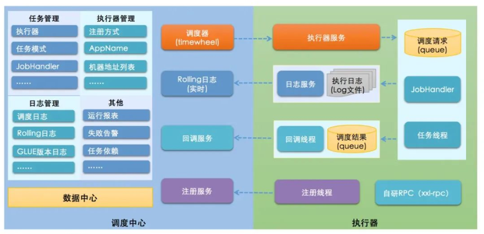

### 需求背景

为实现任务的定期调度，使用简单的spring task框架实现，只需要在启动类添加注解，对目标业务添加注解并配置 **cron 表达式**

- 优点：
  - 不依赖外部框架
  - 实现简单
- 缺点：
  - 硬编码，无法动态调整，需要停止业务，代价大
  - 任务执行失败没有报警
  - 每个实例会执行重复任务，无法使用集群模式

cron表达式： 秒 分 时 日 月 星期几（*代表全时间段；日和星期冲突，需要有一个设 '？'）

### XXL - JOB

#### 架构

XXL-JOB 是一款**轻量级分布式任务调度平台**，调度和执行分离，互不影响

##### 核心成员

- **调度中心**：独立部署的 Web 应用，负责管理任务、触发调度、监控状态。
- **执行器**：集成在业务服务中，负责执行具体任务逻辑。
- **通信方式**：HTTP 长轮询 + 回调（任务执行结果上报）

##### 流程

1. **执行器启动**
   - 向调度中心注册自己的 IP 和端口
   - 写入 `xxl_job_registry` 表(行锁)
   - 定期发送心跳（默认 30s）
2. **调度中心触发任务**
   - 到达 CRON 时间点
   - 查询注册表，找到目标执行器地址
   - 通过 HTTP 请求调用执行器的 `/run` 接口
3. **执行器执行任务**
   - 收到请求，解析任务参数
   - 在线程池中执行 `@XxlJob("methodName")` 标注的方法
4. **结果回调**
   - 执行器通过回调接口将结果（成功/失败/日志ID）上报给调度中心
   - 调度中心更新任务状态，记录日志

#### 阻塞处理策略

当任务执行时间 > 调度周期时：

执行器服务 -> run方法 -> 获取任务线程 -> 任务阻塞策略 -> 请求插入队列中 -> 从队列中获取数据

| 策略           | 说明                             |
| -------------- | -------------------------------- |
| `单机串行`     | 默认，等上一次执行完再执行下一次 |
| `丢弃后续调度` | 如果正在执行，新调度直接丢弃     |
| `覆盖之前调度` | 终止上一次，执行新的（不推荐）   |

####  路由策略

多个执行器实例时，选择哪个执行？

| 策略                  | 说明                               |
| --------------------- | ---------------------------------- |
| 轮询                  | 依次调用                           |
| 随机                  | 随机选择                           |
| 最不经常使用（LFU）   | 调用最少的优先                     |
| 最近最久未使用（LRU） | 最久没调用的优先                   |
| 故障转移（Failover）  | 失败后自动切换到其他节点           |
| 分片广播              | 所有节点都执行（用于本地缓存更新） |

##### 分片

调度中心把一个任务**“广播”给所有执行器实例**，但**每个实例只处理属于自己“分片”的数据**。多个实例并行处理任务

- 定位分片

  - **shardTotal**：总分片数 = 当前在线的执行器实例数量
  - **shardIndex**：当前实例的分片序号（从 0 开始）

  每个实例获取自己的序列号，只处理自己序列号范围内数据；通过广播 + 过滤的机制并行处理数据

#### 高可用与部署

| 问题                     | 回答                                                         |
| ------------------------ | ------------------------------------------------------------ |
| **调度中心能高可用吗？** | 可以，部署多个 Admin 实例，用 Nginx 做负载均衡               |
| **执行器如何注册？**     | 执行器启动时，通过 HTTP 向 Admin 注册 IP 和端口，**定时发送心跳** |
| **注册中心是什么？**     | XXL-JOB 自带轻量级注册中心（基于 DB），执行器将地址写入 `xxl_job_registry` 表 |