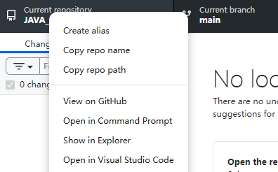

#### 方法尝试

​	试过用git进行本地仓库维护，发现太复杂，有文档也可能出错，所以选择了更简单的**GitHub Desktop**来维护本地仓库

#### **步骤 1：克隆原有仓库**

1. **打开 GitHub Desktop**

   - 安装并启动 GitHub Desktop，登录你的 GitHub 账号。

2. **克隆仓库**

   - 点击左上角菜单栏的 `File` → `Clone Repository`。

   - 在弹出窗口中，切换到 **URL** 选项卡

     

     - `hubot/..`：输入你的git仓库地址
   
       

     - `Local..`：存到本地路径

   - 点击 **Clone**，等待下载完成。

#### **步骤 2：覆盖本地文件**

1. **打开本地仓库文件夹**
   
   - 在 GitHub Desktop 中，右键点击 `diary` 仓库，选择 `Show in Explorer`。
   
     
   
2. **替换文件**
   
   - 将你准备好的新文件**复制到该文件夹中**：
     - 直接覆盖同名文件（如 `index.html`）。
     - 或添加新文件（如 `new_note.txt`）。
     
   -  注意：如果原有仓库有重要文件（如 `.gitignore`、`README.md`），不要删除它们。
   
     

#### **步骤 3：提交更改**

1. **返回 GitHub Desktop**
   - 你会看到左侧栏显示所有改动的文件（标记为 `Changes`）。
2. **填写提交信息**
   - 在左下角的输入框填写 **Summary**（必填，如 `Update diary entries`）。
   - 可选的 **Description** 中可添加详细说明（如 `Added June notes`）。
   - 点击 **Commit to main**（或当前分支名）。

#### **步骤 4：推送到 GitHub**

1. **推送更改**
   - 点击右上角的 **Push origin**，将本地提交同步到 GitHub。
   - 如果这是第一次推送，可能会提示输入 GitHub 账号密码（或验证 SSH 密钥）。
2. **验证更新**
   - 打开浏览器，访问你的 GitHub 仓库页面（`https://github.com/你的用户名/diary`）。
   - 确认文件已更新，提交记录（Commit）显示正常。

#### **常见问题**

1. **冲突提示**：
   - 如果其他人修改过远程仓库，需先点击 **Pull origin** 拉取最新版本，合并冲突后再推送。
2. **文件未显示改动**：
   - 确保文件复制到了正确的本地仓库文件夹内（检查路径是否与克隆路径一致）。
3. **误删文件**：
   - 在 GitHub Desktop 的 `Changes` 中，被删除的文件会显示为 `Deleted`。如果需要恢复，右键点击文件选择 `Discard changes`。