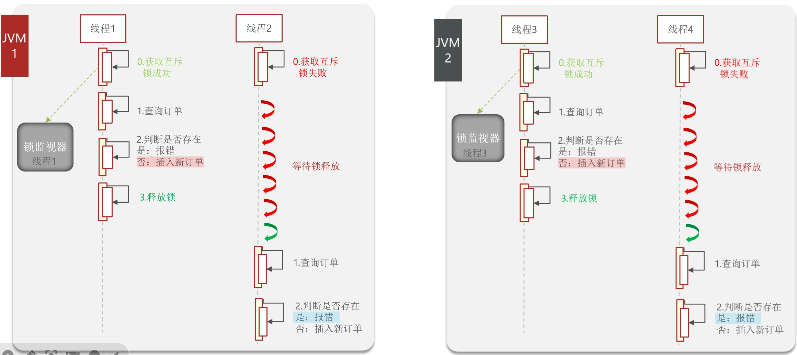
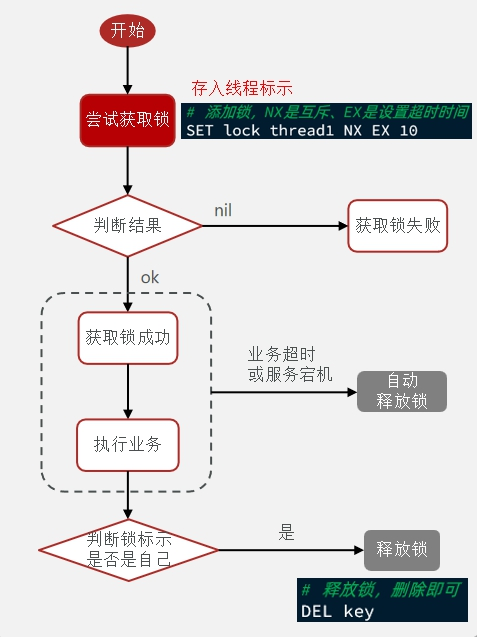
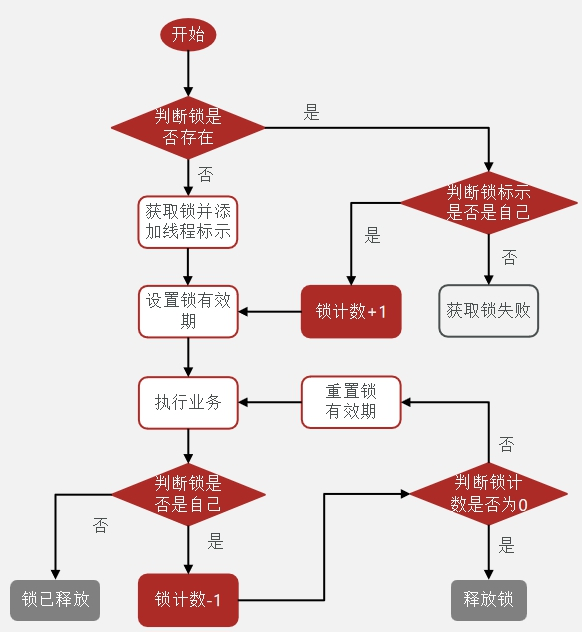

### 分布式

#### 概念

- 分布式指一组独立的计算机（通常称为节点）通过网络互相连接并通信，共同完成一个或多个任务，从外部来看就像一台计算机一样工作。
  - 并发性：多个计算资源同时处理不同的任务或任务的不同部分。
  - 缺乏全局时钟：在分布式系统中，由于各节点可能有不同的本地时间，并且没有统一的时间基准，因此很难定义事件发生的绝对顺序。
  - 独立故障：每个节点都可能独立地发生故障，而其他节点可能继续正常运行。这就要求系统具有容错能力。
  - 可扩展性：可以通过增加更多的机器来处理更高的负载或者更大的数据量，从而实现水平扩展。

#### 问题

在点评项目中，为解决一人抢多张秒杀卷的问题，需要采用锁。

但是锁只能管理一个JVM下的程序，在分布式或集群环境下，不同设备同时收到同一人请求仍然会放行



#### 分布式锁

在分布式系统或集群模式下多进程可见并且**互斥**的锁。

- 三种实现：Mysql(本身互斥锁)、Redis(setnx命令)、Zookeeper

- redis锁 -自己实现

  - 创建锁对象

  - 获取锁：setnx，互斥
  - 释放锁：超时释放  (原子性：要么都成功，要么都失败)

  ```sql
  SET lock thread1 NX EX 10 
  ```

  - 尝试获取锁：失败不等待，直接返回false

  -  注意在判断与操作中保证原子性(用事务)

  - 总实现思路

    - 利用 `set nx ex`获取锁，设置过期时间，保存线程标识
    - 释放锁时优先判断线程标识是否与自己的一致，一致则删除
    - `set nx`满足互斥性
    - `set ex`保证故障时锁依然释放，避免死锁，提高安全性
    - Lua脚本 保证判断与删除锁的原子性
    - 利用redis集群保证高可用和高并发

    

- redission锁 - 成熟框架

  在redis基础上实现的分布式工具的集合。

  - **不可重入**：同一个线程无法获取同一把锁，A线程获取锁，调用B，B无法获取锁
  - 解决方法：再次获取锁时判断是不是同一线程，定义state记录获取锁次数
  - 注意：保证获取锁和释放锁的原子性

  

  - redisson分布式锁原理
    - 可重入：利用hash结构记录线程id和重入次数
    - 可重试：利用信号量和pubsub功能实现等待、唤醒、获取和失败的重试机制
    - 超时续约：利用watchDog，每隔一段时间(releaseTime/3)，重置超时时间
    - multilock，多个独立节点，必须所有节点获取锁才能操作(解决主从模式的问题)

- 自动拆箱安全风险

  - 返回要求是基础类型，return包装类(对应值，null)时，若值为null，会报错

   

### 并发

#### 关键指标

- **TPS (Transactions Per Second)**：每秒**事务处理**量。

  ​	事务指的是客户机向服务器发送请求然后服务器做出反应的过程。包括用户请求、服务器内部处理以及服务器返回响应给用户。TPS可以理解为**系统每秒钟能够处理的完整业务流程的数量**。不仅涵盖了简单的查询操作，还包括了数据修改（增删改）等复杂的业务逻辑处理。

- **QPS (Queries Per Second)**：每秒**查询**率。

  ​	指一台服务器每秒能够响应的查询次数，用于衡量查询服务器在规定时间内所处理流量的能力。**QPS主要针对的是查询操作**，比如数据库中的每秒执行查询SQL的次数，并不包含复杂的业务逻辑处理。

- **JMeter监听**
  - TPS 为每秒完成的请求数（请求成功并返回响应）。JMeter 中通过统计**吞吐量来表示 TPS**。
  - QPS 为每秒发出的查询次数。如果一个事务中包含多个查询，**QPS 可能会大于 TPS**。