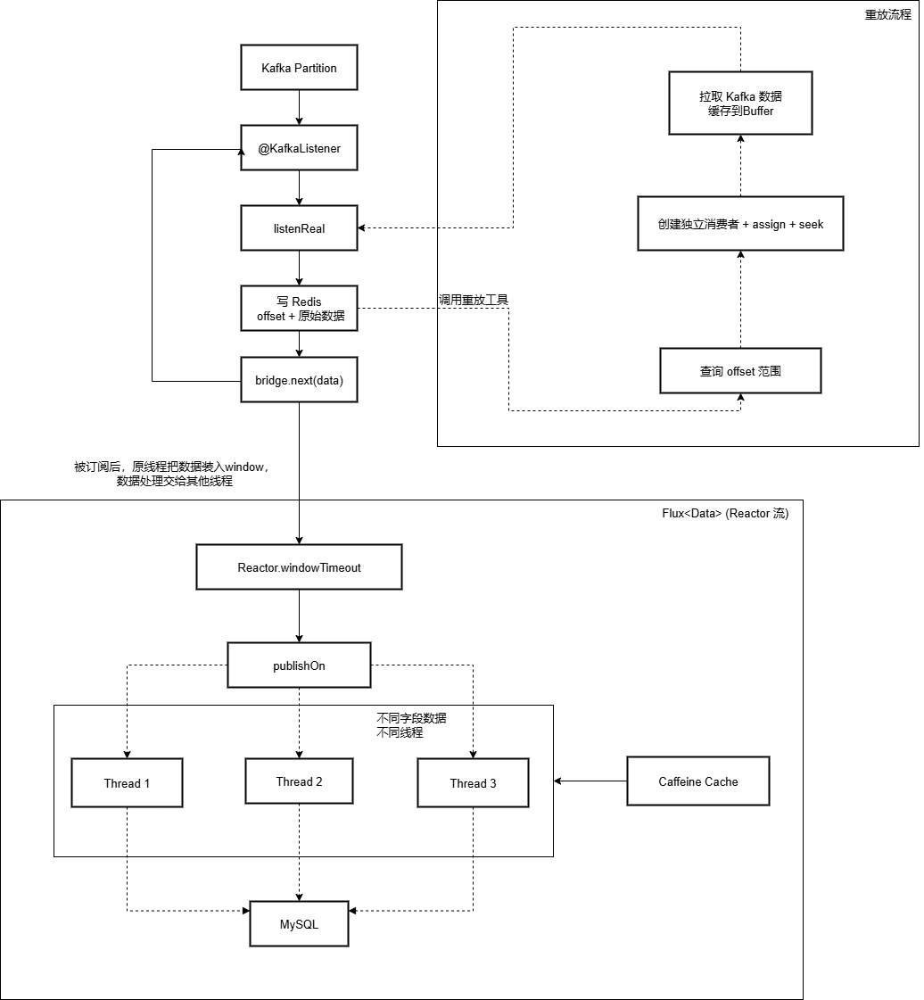

## 弘量后端开发复盘

**技术栈**：Java, Spring Boot, Kafka, Reactor, Redisson, MySQL, XXL-JOB, MyBatis, Caffeine, Lua

### 项目背景

​	我在实习期间参与了公司智能投顾平台的数据中台建设。系统通过 Kafka 接收上游基金、估值、风险等数据，在下游进行处理并写入数据库，支撑前端展示与风控决策。随着业务增长，原有链路暴露出吞吐低、死锁频发、运维困难等问题。我主导并参与了多项核心优化，从**性能、稳定性、可观测性**三个维度提升了系统能力，最终支撑了 AI 风控模块的顺利上线。

### 1. 白名单过滤机制

#### 背景：

​	在日常开发和问题排查中，经常需要对某只基金（或某个 performanceId）的数据进行**重新处理**，比如修复计算错误、验证逻辑变更等。但上游 Kafka 主题推送的是**全量数据**，如果直接重新消费，会处理大量无关数据。

#### 问题：

- 全量数据消费耗时高（**单次处理耗时达 3200ms**），效率低下。
- 无效数据写入频繁，**数据库压力大**，影响系统稳定性。
- 缺乏灵活的过滤机制，无法按需处理指定基金数据。
- 原有逻辑无白名单控制，**不支持动态配置**，每次调试需手动修改代码或重启服务。

#### 行动：

1. **定义白名单服务**
   - 使用 `CopyOnWriteArraySet<String>` 存储允许处理的 `performanceId`。
   - 提供 方法，白名单为空时默认不限制。
2. **实现动态配置 API**
   - 提供 REST API（`/add`, `/remove`）实时增删白名单
   - 白名单存储在内存，无需重启服务即可生效。
3. **保障线程安全与性能**
   - 使用 `CopyOnWriteArraySet` 保证读多写少场景下的并发安全。
   - 白名单为空时直接放行，避免性能损耗。

#### 话术：

我负责下游数据处理，上游通过 Kafka 推送全量数据。
当我们需要重新处理某只基金的数据时，如果消费全量消息，会浪费大量资源，耗时高达3200ms。所以我设计了一个**动态白名单过滤机制**：通过RESTAPI配置需要处理的`performanceId`，消费时先调用`isFundAllowed()`判断，不匹配的直接过滤。白名单存储在内存中，使用`CopyOnWriteArraySet`保证线程安全，支持热更新。最终，处理耗时降到19ms，数据库写入减少95%，成为团队日常调试的标准工具。

#### 提问：

| 问题                                                         | 回答思路                                                     |
| ------------------------------------------------------------ | ------------------------------------------------------------ |
| **Q1：为什么用 `CopyOnWriteArraySet`？不用 `ConcurrentHashMap` 或 `Collections.synchronizedSet`？** | - `CopyOnWriteArraySet` 适合**读多写少**场景（白名单配置不频繁） - 读操作无锁，性能高 - 写操作加锁并复制数组，保证线程安全 |
| **Q2：白名单数据只存在内存，服务重启会丢失，怎么办？**       | - 可以结合 Redis 持久化存储 - 或启动时从 DB 加载 - 或通过配置中心（如 Nacos）管理 |
| **Q3：如果白名单很大（比如 10 万个 ID），`contains()` 性能如何？** | - `CopyOnWriteArraySet` 底层是 `TreeSet`？不，它是基于 `CopyOnWriteArrayList`，`contains()` 是 O(n) - 如果数据量大，应改用 `ConcurrentHashMap`（O(1)） - 但实际场景白名单通常较小，可接受 |
| **Q4：你是怎么测试这个功能的？**                             | - 写单元测试验证 `isFundAllowed()` - 模拟 Kafka 消息，验证过滤逻辑 - 对比开启/关闭白名单的处理耗时 |

### 2. 异步响应式数据链路

#### 背景：

​	下游有些数据的处理可能需要与库中数据对比；所以通过（按照项目组的架构要求）**Reactor + windowTimeout 批量消费，结合 MyBatis 批量插入和 Caffeine 把数据库数据缓存到本地，提升吞吐量、减少 DB 查询**。

#### 问题：

- 如何提升 Kafka 数据消费的**吞吐量**？
- 如何降低对数据库的**频繁访问压力**？
- 如何在保证顺序性和一致性的前提下，实现**高效批量处理**？
- 如何减少因重复查询导致的**性能损耗**？

#### 行动：

1. **使用 Reactor + `windowTimeout` 实现批量消费**
   - 将流式数据按“时间窗口”或“数量窗口”分批处理，提升吞吐。
   
   - 采用 **Project Reactor** 模型（响应式编程），将 Kafka 消息流转换为 `Flux<ConsumerRecord>`。
   
2. MyBatis 批量插入

   - 减少数据库 round-trip 次数，提升写入性能。
   - 将窗口内的数据聚合为 `List<T>`，调用insertBatch` 方法。使用 `SqlSessionTemplate` 配合 `ExecutorType.BATCH，实现 JDBC 批量插入。

3. 引入 **Caffeine 本地缓存高频数据**

   - 减少对数据库的重复查询，提升处理速度。
   - 使用 **Caffeine** 将其缓存在 JVM 内存中，在数据处理前，优先从缓存中获取，**避免每次查询 DB**。   <!--（如何清除？）-->

4. 线程调度优化：`publishOn` 保障隔离性

#### 话术：

​	基于响应式架构，构建了异步数据链路：使用 **Reactor 的 windowTimeout** 将消息按 1000 条或 10 秒分批，通过 **MyBatis 批量插入**提升写入效率，并引入 **Caffeine 本地缓存**高频维度数据，避免重复查库。
​	同时使用 **publishOn** 将处理逻辑切换到独立线程，保障消费线程不被阻塞。最终，吞吐量提升 40%，日均减少 DB 查询 30 万次，系统稳定性显著增强。

#### 提问：

| 问题                                                         | 回答思路                                                     |
| :----------------------------------------------------------- | ------------------------------------------------------------ |
| **Q1：为什么用 Reactor？不用线程池 + 阻塞队列？**            | - Reactor 更适合流式数据处理，支持背压（backpressure） - 资源利用率高，无需管理线程生命周期 - 与 Spring WebFlux 生态兼容，适合响应式架构 |
| **Q2：windowTimeout 的参数怎么定的？1000条 or 10秒？**       | - 通过压测和线上观察调优：太小 → 吞吐低；太大 → 延迟高 - 1000条是 Kafka 单次拉取的大致数量级，10秒是可接受的最大延迟 |
| **Q3：批量插入失败怎么办？如何保证一致性？**                 | - 使用事务包裹 `insertBatch` - 失败时记录日志，支持重试或人工干预 - 不追求完全原子性（因是幂等写入），但保证最终一致 |
| **Q4：Caffeine 缓存和 Redis 有什么区别？为什么不用 Redis？** | - Caffeine 是本地缓存，**访问速度极快（纳秒级）** - Redis 有网络开销，适合共享缓存 - 该数据为“只读+高频”，本地缓存更合适 |
| **Q5：缓存如何更新？有缓存一致性问题吗？**                   | - 设置 TTL（1小时），定期失效重载 - 若有强一致性要求，可加监听机制（如 DB binlog）主动失效 |

### 3. Kafka 数据重放工具

#### 背景：

​	在智能投顾平台的数据中台中，上游通过 Kafka 持续推送基金、行情、估值等关键数据，下游服务负责消费并写入数据库，支撑前端展示、用户资产计算和风控决策。在实际运维过程中，不可避免会出现BUG或异常需要验证

​	**原有流程**是发现问题后，需联系上游团队，请求他们**重新推送当天的全量数据**。这种方式存在严重问题：

- **效率极低**：依赖他人，沟通成本高
- **资源浪费**：重放全量数据，处理大量无关消息
- **风险高**：可能重复写入、影响线上稳定性
- **不精准**：无法按时间或 offset 精确定位

#### 问题：

- 如何让下游团队**自主、快速**地重放数据，不再依赖上游？
- 如何实现**精准回溯**？支持按“基金名 + 时间”或“基金名 + offset”定位数据范围？
- 如何保证重放过程**顺序性、一致性、安全性**？
- 如何将重放能力**产品化**，成为团队标准运维工具？

#### 行动：

1. **精准回放执行引擎**
   - **技术**：`Redisson` + `RScoredSortedSet`
   - 在消费链路中自动记录每类数据（`DataType`）的 `offset` 起止范围与对应时间戳。
   - 使用 `RScoredSortedSet` 存储，以 `start offset` 为 score，支持高效范围查询。
   - 连续 offset 自动合并为范围，减少存储与写入开销。
2. **精准回放执行引擎**
   - **技术**：`Spring Kafka` + `REST API` + `Custom Consumer`
   - 提供 REST 接口，支持按 `dataType + offset` 或 `dataType + time` 查询目标范围。
   -  从 Redis 查询符合条件的 offset 区间。
   - 创建独立 `group.id` 的 Kafka Consumer，通过 `assign()` 和 `seek()` 定位起始位置。
   - 单线程串行拉取，使用 `recordBuffer` 批量复用 `listenReal()` 消费逻辑，保障顺序性与稳定性。
3. **系统隔离与安全**
   - 重放 consumer 不提交 offset，避免污染正常消费进度。
   - 任务完成后自动删除临时 consumer group，资源自动回收。

#### 话术：

​	在实习中，我发现每次修复数据问题都要联系上游重放全量数据，效率低、风险高。为此，我主导开发了 **Kafka 数据重放工具**：
首先，在消费时自动记录每类数据的 offset 与时间范围，**存入 Redis 的有序集合**；然后，提供 REST API，支持按‘基金类型 + 时间’或‘+ offset’查询目标范围；最后，通过**独立 Consumer 单线程拉取并重放，复用现有消费逻辑**。这个工具让团队可以自助精准回放，累计使用 240+ 次，成为标准运维手段。”

#### 提问：

| 问题                                                         | 回答思路                                                     |
| ------------------------------------------------------------ | ------------------------------------------------------------ |
| **Q1：为什么用 Redis 存 offset 范围？不用 Kafka 自带的 timestamp 查询？** | - Kafka 的 `offsetsForTimes()` 精度有限，且不支持按业务维度（如基金名）查询 - 我们需要的是 **“某类数据在某时间的 offset”**，而 Kafka 只能按 partition 查 - Redis 提供灵活的索引能力，支持复杂查询 |
| **Q2：为什么要把 offset 聚合成范围？不存每条？**             | - 减少存储量和写入频率 - 实际消费是连续的，聚合更符合现实模式 - 查询效率更高 |
| **Q3：重放时如何保证不重复写入 DB？**                        | - 重放数据可打标（如 `replay=true`），写入隔离表 - 或先清理目标数据再重放 - 或确保写入逻辑幂等 |
| **Q4：Consumer 是如何避免影响正常消费的？**                  | - 使用独立 `group.id` - 不提交 offset - 单线程拉取，避免 rebalance |
| **Q5：如果数据量很大，重放很慢怎么办？**                     | - 支持分页重放（按 offset 分段） - 增加并发（但需考虑顺序性） - 异步任务调度 |

### 4. 基金风险数据迁移

#### 背景：

​	项目需将历史基金风险数据**（约 18 万条）**从旧系统数据库迁移至新系统数据库，支撑 AI 风控评分模块的上线。新表 t_ai_risk 的主键为 fund_code，但风险数据是按日期维度存储的，实际去重逻辑为：**fund_code + date 联合唯一**。原有全量同步脚本存在性能问题：使用 `LIMIT offset, size` 分页导致深度分页慢，且未建立合理索引，单次查询耗时高达 550ms，影响线上服务。

#### 问题：

- 数据量大（18 万条），全量同步耗时长，影响系统稳定性。
- 使用 `LIMIT offset, size` 分页，**深度分页性能急剧下降**（如 `LIMIT 100000, 1000` 极慢）。
- 缺乏去重机制，可能重复写入相同 `fund_code + date` 的数据。
- 目标表缺少联合索引，查询与更新效率低。
- 需要与 `t_fund_basic_info` 表关联，获取 `fund_code`，不能直接迁移原始 `performance_id`。

#### 行动：

1. **数据关联映射**

   - 数据处理前加载`t_fund_basic_info`表数据到本地缓存，减少IO次数

2. ##### **`fund_code + date` 唯一**

   - 在插入时通过数据库 `ON CONFLICT (fund_code，data)` 机制处理冲突（结合业务逻辑判断是否更新）。

3. ##### **高效分页：基于主键范围查询（避免 `LIMIT offset`）**

   - **核心优化**：用 `WHERE performance_id > ? ORDER BY performance_id LIMIT ?` 替代 `LIMIT offset, size`
   - 利用 `performance_id` 索引，避免全表扫描，性能稳定。

#### 话术：

​	在 AI 风控模块上线时，需要将 18 万条历史风险数据从旧库迁移到新表。原有脚本使用 `LIMIT offset` 分页，深度分页性能差，单次查询 550ms。为此，我设计了基于 **主键范围分页** 的同步方案：按 `performance_id > lastId` 分批读取，每批 1000 条，避免深度分页问题。同时，通过 `t_fund_basic_info` 表关联获取 `fund_code`，并确保 `fund_code + date` 唯一。迁移后创建联合索引，查询耗时降至 70ms，性能提升 77%，支撑风控评分高效运行。

#### 提问：

| 问题                                                        | 回答思路                                                     |
| ----------------------------------------------------------- | ------------------------------------------------------------ |
| **Q1：为什么用主键分页？不用 `LIMIT offset`？**             | - `LIMIT offset` 深度分页会跳过大量数据，性能差（O(n)） - 主键范围查询利用索引，性能稳定（O(log n)） - 适合大数据量迁移 |
| **Q2：如果 `performance_id` 不连续或有空洞，会影响吗？**    | - 不影响，我们只关心“大于某个值”的下一批数据 - 只要有序即可 |
| **Q3：如何保证迁移过程中不丢数据？**                        | - 记录 checkpoint（最后处理的 `performance_id`） - 支持断点续传 |
| **Q4：为什么创建 `(fund_code, date)` 索引？不建单列索引？** | - 业务查询常为“某基金在某时间段的风险” - 联合索引可覆盖该查询，避免回表 - 单列索引无法高效支持范围查询 |

### 5.1. offset持久化

#### 背景：

​	下游服务通过 Kafka 消费上游推送的基金、行情等关键数据。一旦服务重启或发生故障转移，**消费进度（offset）丢失**会导致：

- **数据丢失**：未处理的消息被跳过
- **数据重复**：已处理的消息被重新消费，可能造成重复写入、计算错误

虽然 Kafka 支持自动提交 offset，但存在以下问题：

- 自动提交是周期性的，可能提交过早（消息未处理完）或过晚（重复消费）
- 无法与外部系统（如重放工具、监控）联动
- 不支持精确回溯

因此，需要一套**更可靠、更灵活、可追溯**的 offset 管理机制。

#### 问题：

- 如何在服务重启后**不丢失消费进度**？
- 如何避免**重复消费**已处理的数据？
- 如何与“数据重放工具”联动，支持**精确回放**？
- 原有逐条记录 offset 的方式写入频繁，性能差，如何优化？

#### 行动：

1. **Offset 范围聚合**

   - **不记录每一条 offset**，而是将**连续消费的 offset 聚合成一个范围**（`startOffset` → `endOffset`）。
   - 只有当 offset **不连续**（如跳跃、重启后）时，才将当前范围写入 Redis，大幅减少 Redis 写入次数。
   - 使用Redisson 的 `RScoredSortedSet<OffsetRange>`存储
     - **Key**：`databus:offsets:{dataType}`
     - **Score**：`startOffset`（便于按 offset 查询）
     - **Value**：`OffsetRange` 对象（含 start/end offset 和时间戳）

2. ##### 保障“不丢不重”

   | 保障目标         | 实现方式                                                     |
   | ---------------- | ------------------------------------------------------------ |
   | **✅ 不丢数据**   | - 消费进度持久化到 Redis，服务重启后可恢复 - 结合“数据重放工具”，可从任意 offset 重新拉取 |
   | **✅ 不重复消费** | - 在 `CustomOffsetConsumerService` 中，使用 `consumer.seek(partition, range.getStart())` 精确跳转到起始 offset - 避免 Kafka 自动提交 offset 的不确定性 - Redis 中的 `RScoredSortedSet` 按 `start` 排序，天然去重（相同范围不会重复写入） |

3. ##### 与重放工具深度集成

   - **写时记录**：正常消费时，持续更新当前 offset 范围。
   - **读时回放**：当需要重放时，从 Redis 查询目标范围，consumer 精准 `seek` 到 `range.getStart()` 开始拉取。
   - **形成闭环**：正常消费 → 记录 offset 范围 → 异常修复 → 按范围重放 → 继续消费

4. ##### 性能与稳定性优化

   - **内存缓冲**：中使用 `Map<DataType, Long>` 缓存当前连续 offset，避免频繁写 Redis。
   - **定时刷盘**：通过 `@Scheduled(fixedRate = 5000)` 每 5 秒批量刷入 Redis，平衡实时性与性能。
   - **异常兜底**：服务关闭前调用 `flushAll()`，确保最后的 offset 范围写入

#### 话术：

​	在 Kafka 数据链路中，我设计了 **Offset 范围持久化机制**，解决服务重启导致的数据丢失或重复问题。核心是**将连续消费的 offset 聚合成‘范围’（start~end）**，只有**不连续时才写入 Redis**，大幅减少写入压力。
​	使用 Redisson 的 `RScoredSortedSet` 存储，支持按 offset 查询。在重放时，**通过 `consumer.seek()` 精确跳转到起始位置**，保障‘不丢不重’。
这套机制**与我开发的‘数据重放工具’深度集成**，实现了‘时间 ↔ offset’双向映射，成为数据链路可靠性的核心保障。

#### 提问：

| 问题                                              | 回答思路                                                     |
| ------------------------------------------------- | ------------------------------------------------------------ |
| **Q1：为什么用“范围”而不是“最新 offset”？**       | - “最新 offset”无法支持按时间回溯 - 范围保留了时间窗口信息，更适合重放场景 - 可追溯性更强 |
| **Q2：如果服务在写入 Redis 前宕机，会丢数据吗？** | - 会丢失当前未刷盘的 offset 范围 - 但可通过“数据重放工具”手动修复 - 若需更强保障，可引入 WAL（Write-Ahead Log）机制 |
| **Q3：如何处理多个 partition 的 offset？**        | - 当前按 `dataType` 聚合，未区分 partition - 若需精确控制，可扩展为 `(dataType, partition)` 为 key |
| **Q4：和 Kafka 自带的 offset 存储比，优势在哪？** | - Kafka 只存 offset，无时间戳 - 无法支持“按时间回溯” - 我们的方案更灵活，支持运维与调试 |

### 5.2. 定时清理过期 OffsetRange 数据

#### 背景：

​	在“Kafka 数据重放工具”中，我们使用 Redis 的 `RScoredSortedSet` 持久化存储每类数据（`DataType`）的消费 offset 范围（`OffsetRange`），支持按时间或 offset 精准回放。

随着系统长期运行，这些历史数据不断累积，导致：

- **Redis 存储空间持续增长**，增加内存成本
- **查询性能下降**：`RScoredSortedSet` 数据量过大时，范围查询变慢
- **数据冗余**：超过 6 天的历史 offset 已无回放价值（业务上只关注近期异常）

因此，需要一套**自动化的数据清理机制**，定期删除过期数据，保障系统长期稳定运行。

#### 问题：

- 如何定义“过期”？按时间（如 6 天前）？
- 如何安全、高效地批量删除百万级数据，不影响线上服务？
- 如何实现自动化、可监控的清理流程？

#### 行动：

1. ##### **使用 XXL-JOB 实现定时调度**

   - 创建定时任务 `@XxlJob("cleanupExpiredOffsetRanges")`。
   - 配置 cron 表达式：每天凌晨执行（如 `0 0 2 * * ?`）。
   - 任务日志自动上报 XXL-JOB 控制台，支持监控与报警。

2. ##### **Lua 脚本高效清理（避免网络开销）**

   - **关键优化**：使用 Redisson 的 `RScript` 在 Redis 服务端执行 Lua 脚本，**避免将百万级数据拉回应用层处理**。
   - **优势：**
     - **高效**：在 Redis 内部遍历、解析、删除，网络开销极小
     - **原子性**：脚本执行期间锁定 key，避免并发问题
     - **安全**：只删除满足条件的数据，不误删

3. **服务层封装**

   - 对每个 key 执行 Lua 脚本，传入过期时间（年/月/日）。
   - 统计总删除条数，记录日志。

#### 话术：

​	在数据重放工具运行后，发现 Redis 中的 offset 历史数据不断累积，占用大量内存，影响查询性能。为此，我设计了 **自动清理机制**：通过 XXL-JOB 每天凌晨触发，使用 **Lua 脚本**在 Redis 服务端遍历并删除 6 天前的 `OffsetRange` 数据。脚本解析 JSON 中的 `startTime`，判断是否过期，高效删除。最终，Redis 内存占用下降 40%，系统更轻量、更稳定，实现了自动化资源治理。

#### 提问：

| 问题                                            | 回答思路                                                     |
| ----------------------------------------------- | ------------------------------------------------------------ |
| **Q1：为什么用 Lua 脚本？不用 Java 遍历删除？** | - Java 方式需将所有数据拉回应用层，网络开销大，内存压力高 - Lua 脚本在 Redis 内部执行，效率极高，适合大数据量清理 |
| **Q2：Lua 脚本执行时间过长会阻塞 Redis 吗？**   | - 是的，Redis 是单线程，长脚本会阻塞其他请求 - 我们优化脚本逻辑，避免复杂操作；未来可考虑分批执行或使用 `SCAN` |
| **Q3：如何验证清理结果？**                      | - 查看 XXL-JOB 日志中的 `deletedCount` - 登录 Redis 查询 key 数量变化 - 监控内存使用率 |
| **Q4：为什么是 6 天？怎么确定的？**             | - 与业务方沟通：问题通常在 3 天内发现，6 天足够覆盖所有排查场景 - 可配置，未来可调整 |

### 6. MySQL 死锁问题

#### 背景：

​	在数据中台系统中，通过 **Reactor 的 `windowTimeout`** 批量消费 Kafka 数据，提升吞吐。下游服务将基金风险、估值等数据写入 MySQL 表（如 `t_ai_risk`），主键为 `fund_code`，但业务唯一键为 `(fund_code, alert_date)`。在高并发场景下，系统频繁触发 **MySQL 死锁告警**（平均每天 2 次），导致部分事务回滚，影响风控数据的完整性与实时性。

#### 问题：

- 根本原因：
  1. Kafka 消息虽然按 `offset` 有序，但**消息体内的业务数据无序**（如 `fund_code: 0427, 0428, 0427`）。
  2. `windowTimeout` 将多条消息聚合为一批，并发处理。
  3. 多个事务同时处理 (0427, date) 和 (0428, date)，但加锁顺序分别为：
     - 事务 A：先锁 `0427` → 再锁 `0428`
     - 事务 B：先锁 `0428` → 再锁 `0427`
  4. 当事务并发执行时，可能形成 **循环等待**，触发 MySQL 死锁检测机制，强制回滚其中一个事务。

​	虽然 Kafka offset 有序，但**业务数据无序 + 批量并发处理 = 加锁顺序不可控 = 死锁风险。**

#### 行动：

​	通过**应用层预排序 + 原子 upsert + 重试机制**，实现高性能、无锁化数据一致性保障。

1. ##### **加锁顺序一致性设计**

   | 技术点                           | 说明                                                       |
   | -------------------------------- | ---------------------------------------------------------- |
   | **业务主键 `(fund_code, date)`** | 明确为数据唯一标识，用于排序与去重                         |
   | **应用层预排序**                 | 在 `insertBatch` 前对 list 按 `(fund_code, date)` 升序排列 |
   | **ON DUPLICATE KEY UPDATE**      | 利用 MySQL 原生支持，实现插入或更新的原子操作              |
   | **@Retryable 重试机制**          | 对 `DeadlockLoserDataAccessException` 自动重试 2-3 次      |
   | **事务粒度控制**                 | 每个 batch 独立事务，避免大事务拖慢系统                    |

2. **为什么不用分布式锁？**

   - **性能损耗大**：每条记录都要请求 Redis 加锁 → RT 上升、吞吐下降
   - **复杂度高**：需处理锁超时、误释放、续期等问题
   - **过度设计**：死锁根源是“加锁顺序不一致”，而非“并发写”
   - **正解是排序**：只要所有事务按相同顺序加锁，即可消除循环等待

#### 话术：

​	我们在使用 Reactor 批量消费 Kafka 数据时，发现 MySQL 频繁死锁。经分析，原因是：虽然 offset 有序，但消息体内的业务数据无序，`windowTimeout` 导致多个事务并发处理 (fund_code, date)，**加锁顺序不一致，形成循环等待**。为此，我采用 **“应用层排序 + 原子 upsert”** 方案：在批量写入前，对数据按 (fund_code, date) 预排序，确保所有事务加锁顺序一致，结合 ON DUPLICATE KEY UPDATE 实现原子写入，并**通过重试机制兜底异常**。上线后，死锁告警归零，系统稳定性大幅提升。

#### 提问：
