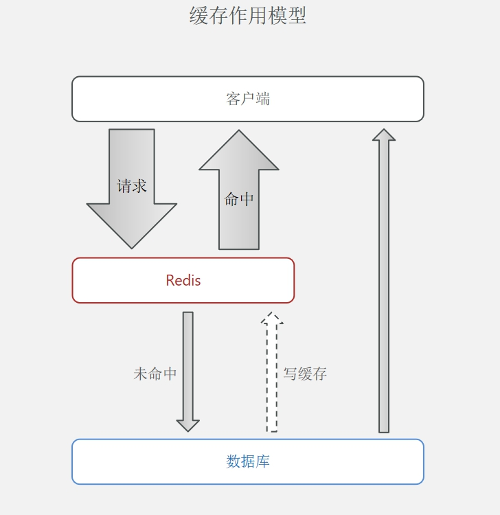
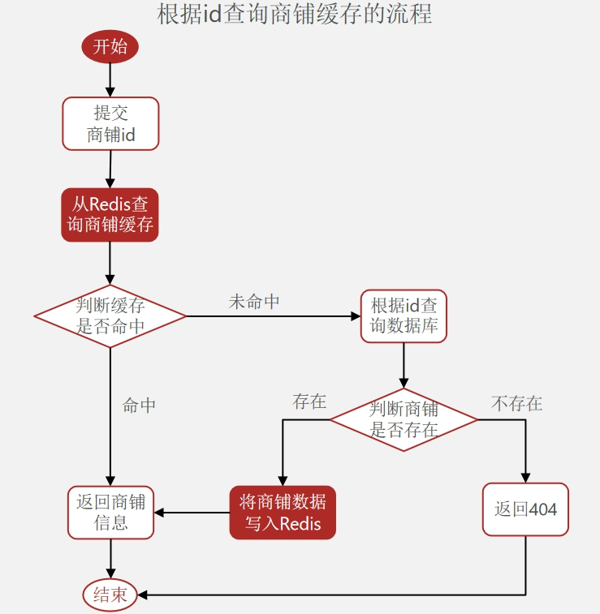
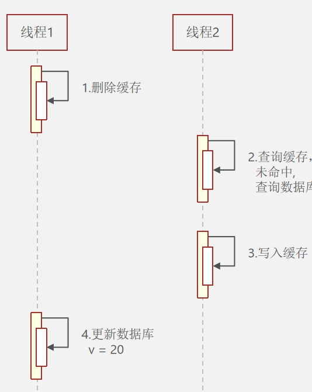
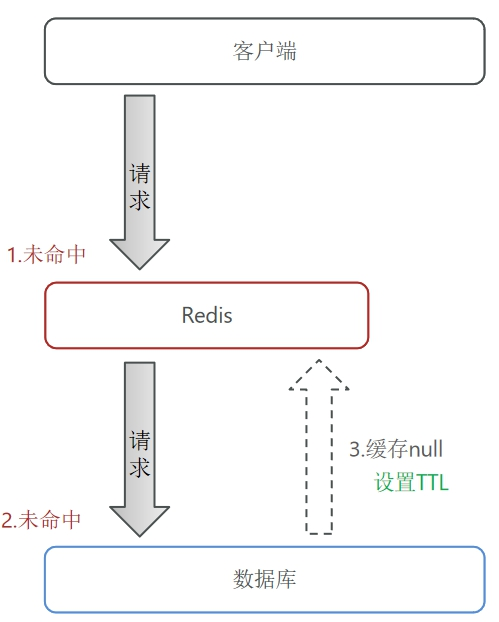
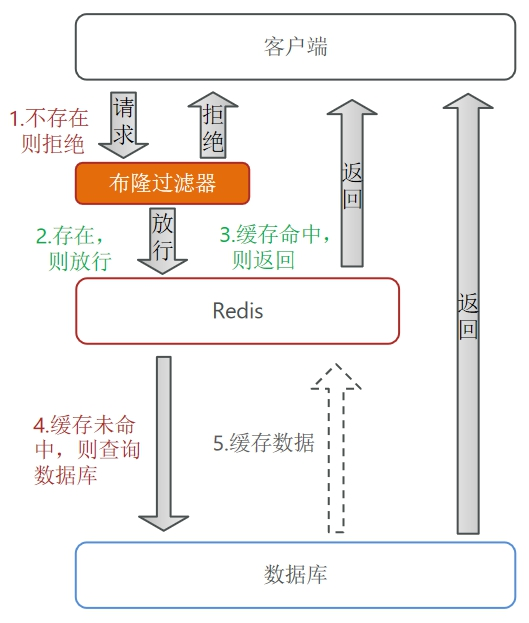
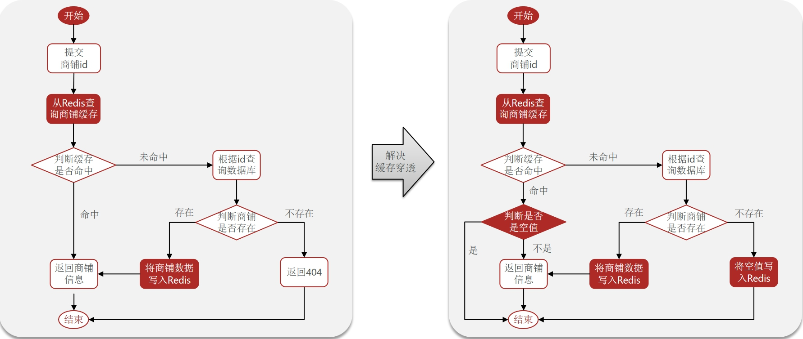
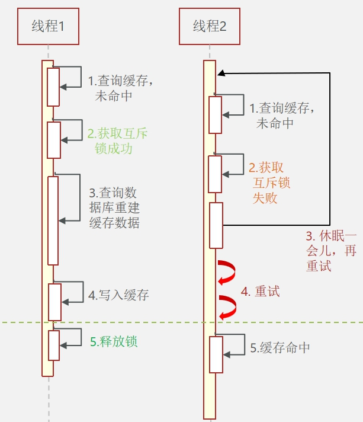
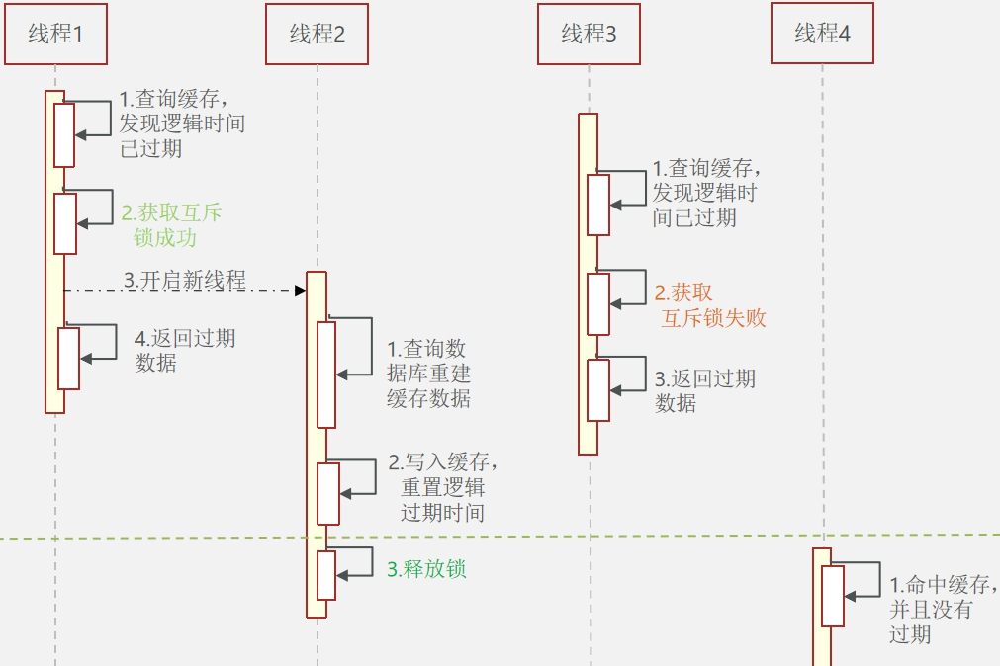

### 缓存

存储数据的临时位置，读写性能较高

#### 概念

- 作用
  - 降低后端成本
  - 提高读写效率，降低响应时间
- 成本
  - 一致性成本
  - 维护成本
  - 运维成本

#### 功能与实例

#### 更新缓存机制

- 淘汰机制

  redis缓存爆满后自动触发淘汰机制，自动删除一部分键值对

  - 一致性差，但不需要维护

- 超时剔除

  给数据添加TTL事件，到期后自动删除，下次查询时更新

  - 一致性可控，维护成本低(加一句TTL)

- 主动更新

  编写业务逻辑，在修改数据库同时更新缓存

  - 一致性高，维护成本也高

#### 线程安全问题

在主动更新时，采取策略：**删除缓存，查询时更新**，但会出现线程安全问题

相比之下，先操作数据库的安全风险更低，所以采取策略：**先操作数据库，后删除缓存 + 超时时间TTL**

#### 标准方案

- 低一致需求：采取**淘汰机制**
- 高一致需求：采取**主动更新，以超时剔除兜底**

- 读操作标准策略
  - 缓存命中直接返回
  - 未命中查询数据库，写入缓存设定超时时间
- 写操作标准策略
  - 先写数据库，再删除缓存
  - 确保数据库与缓存操作的原子性(？)

####  缓存穿透

指客户端请求的数据在缓存与数据库中都不存在，且永不生效，所以每次请求都会访问数据库，若大量并发发送此类数据会给数据库带来巨大压力。

- 解决方案

  - 缓存空对象
    - 优：实现简单，维护方便
    - 缺：额外缓存消耗

  

  - 布隆过滤
    - 优：内存占用少
    - 缺：实现复杂，有误判可能

  

  - 其他主动方案
    - 增加ID复杂度
    - 做好数据基础格式校验
    - 加强用户权限，做好热点参数限流

- 缓存空对象实例

  

#### 缓存雪崩

指同一时间大量缓存key同时失效或Redis服务宕机，大量数据到达数据库，带来巨大压力

- 解决方案
  - TTL设置随机值
  - 利用Redis集群(哨兵机制)
  - 给缓存业务添加降级限流策略
  - 多级缓存

#### 缓存击穿

如果一个KEY被高并发访问且缓存重建业务复杂，如果它失效了，大量请求会瞬间给数据库带来冲击。

- 解决方案

  - 互斥锁
    - 一致性，性能受影响

  

  - 逻辑过期

    - 可用性，实现复杂，性能高

      

